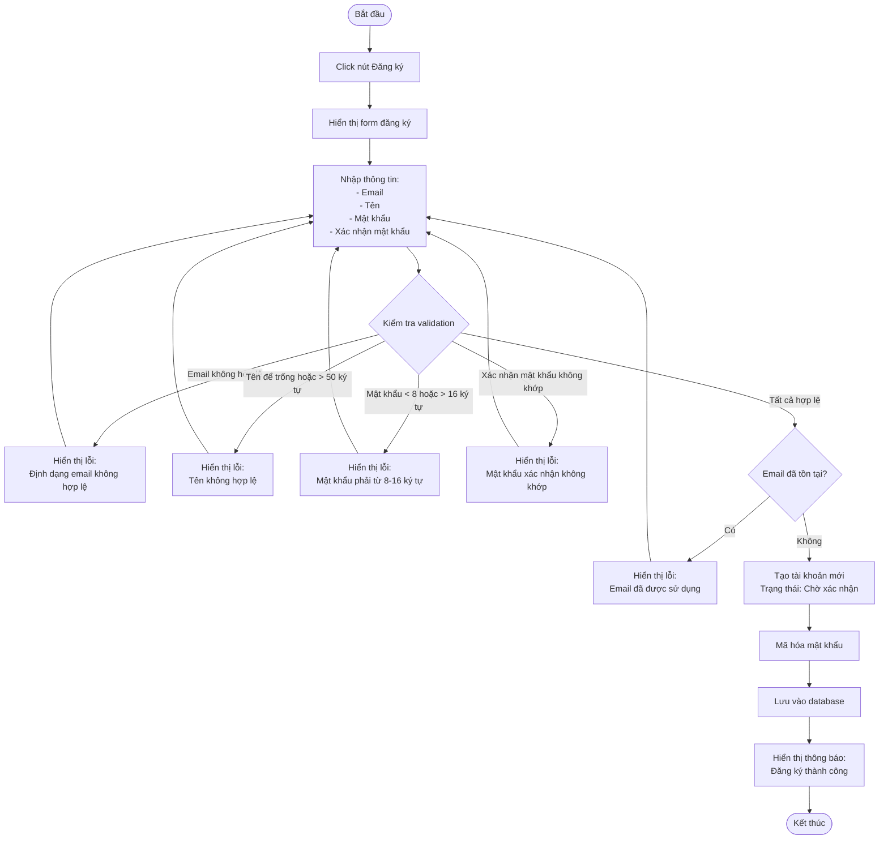
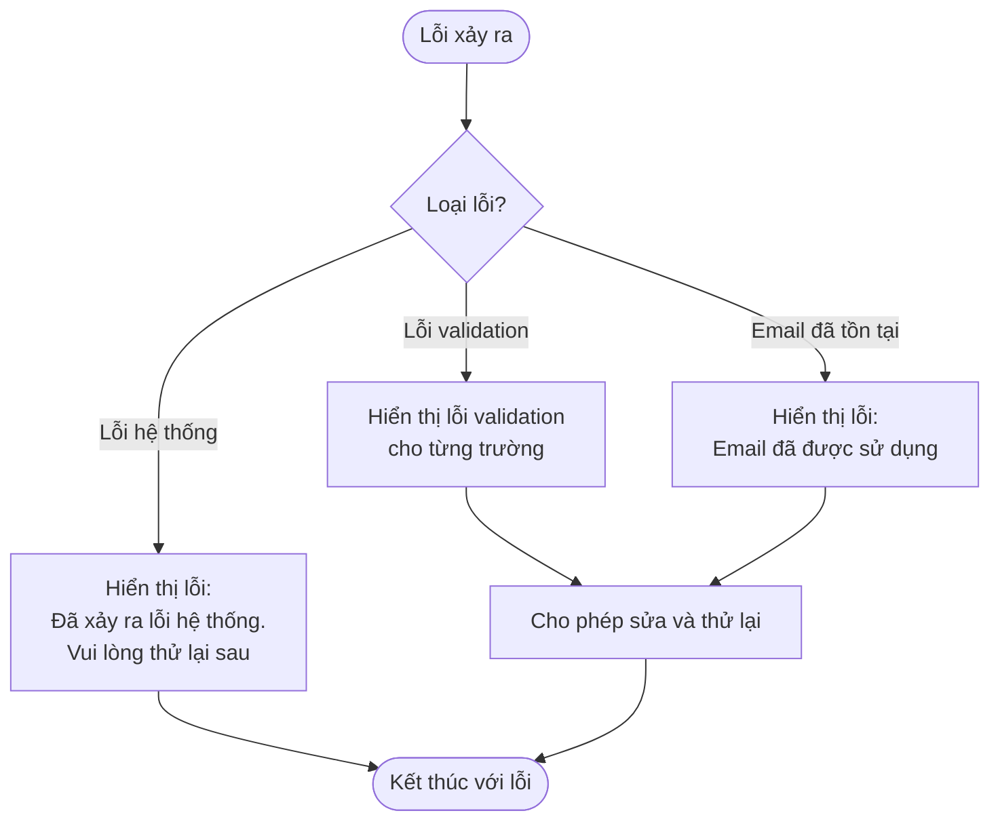

# 2.1.1 Đăng Ký (User Registration)

## Thông tin chung
- **Actor:** Mọi người
- **Yêu cầu:** Không có
- **Mô tả:** Cho phép người dùng mới đăng ký tài khoản trong hệ thống

## Luồng chính

## Luồng thay thế

### Luồng 1: Email đã tồn tại
- Người dùng nhập email đã được đăng ký
- Hệ thống hiển thị lỗi và yêu cầu nhập email khác

### Luồng 2: Validation lỗi
- Người dùng nhập dữ liệu không hợp lệ
- Hệ thống hiển thị lỗi cụ thể cho từng trường
- Người dùng có thể sửa và thử lại

## Xử lý lỗi

## Quy tắc validation

| Trường | Quy tắc |
|--------|---------|
| Email | Định dạng email hợp lệ, không được để trống |
| Tên | Không được để trống, tối đa 50 ký tự |
| Mật khẩu | Không được để trống, tối thiểu 8 ký tự, tối đa 16 ký tự |
| Xác nhận mật khẩu | Không được để trống, phải trùng với mật khẩu |

## Trạng thái sau khi đăng ký
- Tài khoản được tạo với trạng thái: **"Chờ xác nhận"**
- Người dùng cần đợi quản trị viên kích hoạt tài khoản trước khi có thể đăng nhập

