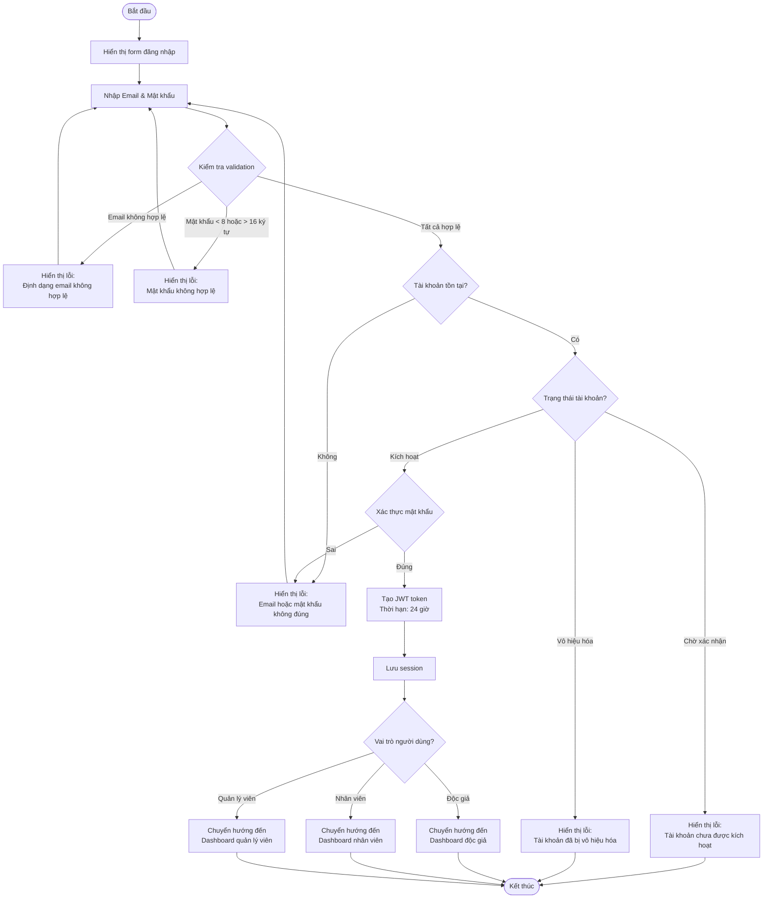
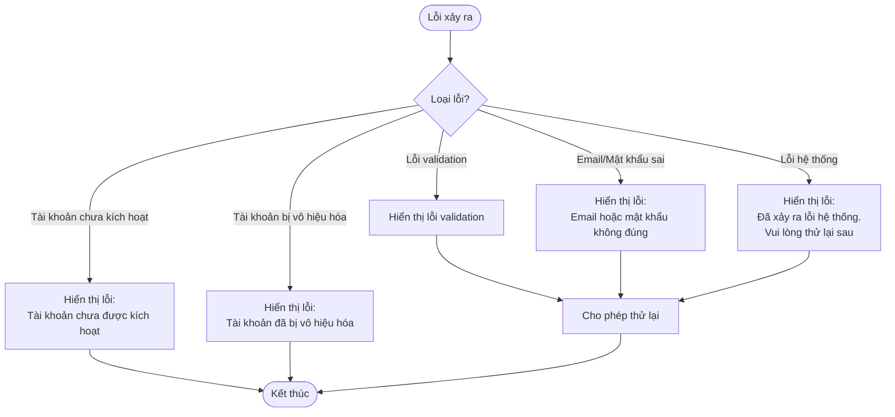

# 2.1.2 Đăng Nhập (User Login)

## Thông tin chung
- **Actor:** Mọi người
- **Yêu cầu:** Không có (nhưng cần có tài khoản đã được kích hoạt)
- **Mô tả:** Cho phép người dùng đăng nhập vào hệ thống với email và mật khẩu

## Luồng chính

## Luồng thay thế

### Luồng 1: Quên mật khẩu
- Người dùng click "Quên mật khẩu"
- Hệ thống gửi email reset mật khẩu (nếu tính năng này được triển khai)

### Luồng 2: Tài khoản chưa kích hoạt
- Người dùng đăng nhập với tài khoản ở trạng thái "Chờ xác nhận"
- Hệ thống hiển thị thông báo và không cho phép đăng nhập

### Luồng 3: Tài khoản bị vô hiệu hóa
- Người dùng đăng nhập với tài khoản bị vô hiệu hóa
- Hệ thống hiển thị thông báo và không cho phép đăng nhập

## Xử lý lỗi

## Quy tắc validation

| Trường | Quy tắc |
|--------|---------|
| Email | Định dạng email hợp lệ, không được để trống |
| Mật khẩu | Không được để trống, tối thiểu 8 ký tự, tối đa 16 ký tự |

## Chi tiết kỹ thuật

### JWT Token
- **Thời hạn:** 24 giờ
- **Payload:** User ID, Email, Role
- **Lưu trữ:** Cookie hoặc LocalStorage (tùy theo implementation)

### Session Management
- Token được gửi kèm trong header của mọi request
- Server validate token trước khi xử lý request
- Token hết hạn → yêu cầu đăng nhập lại

