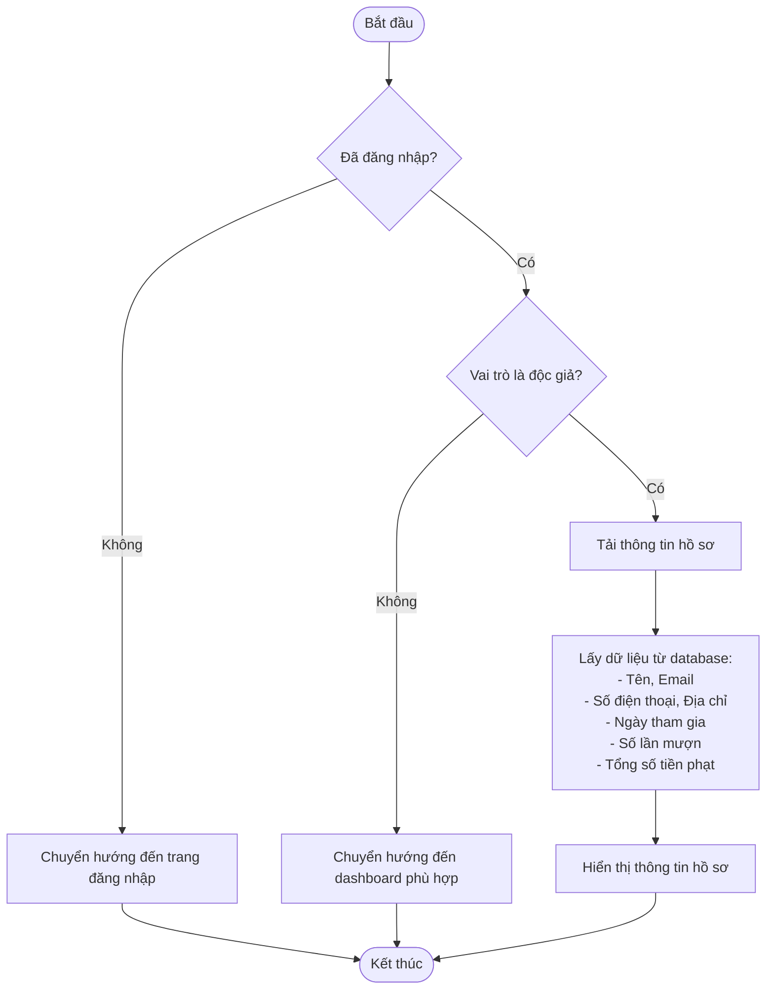
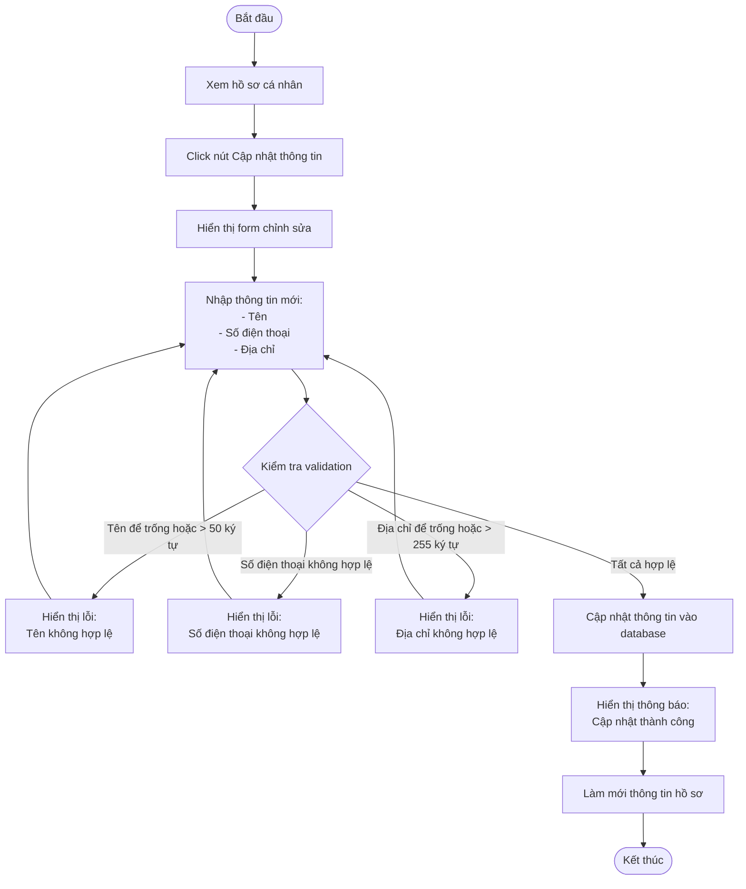
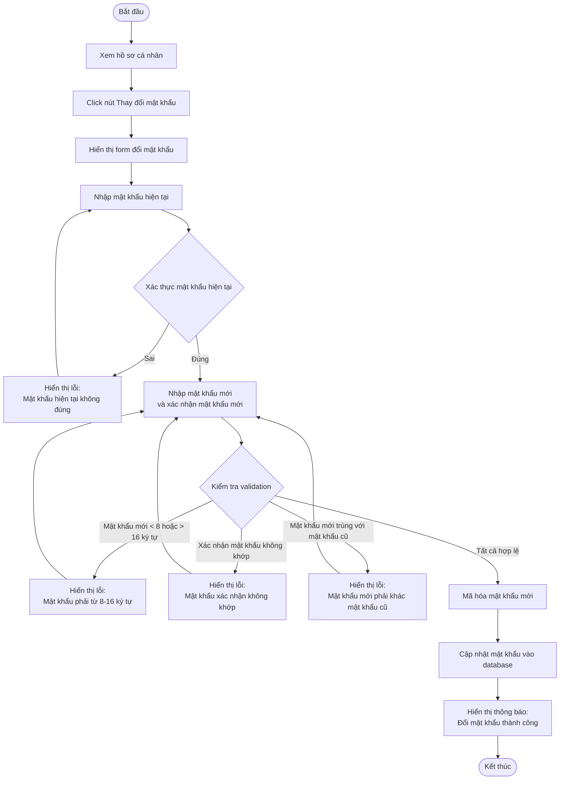
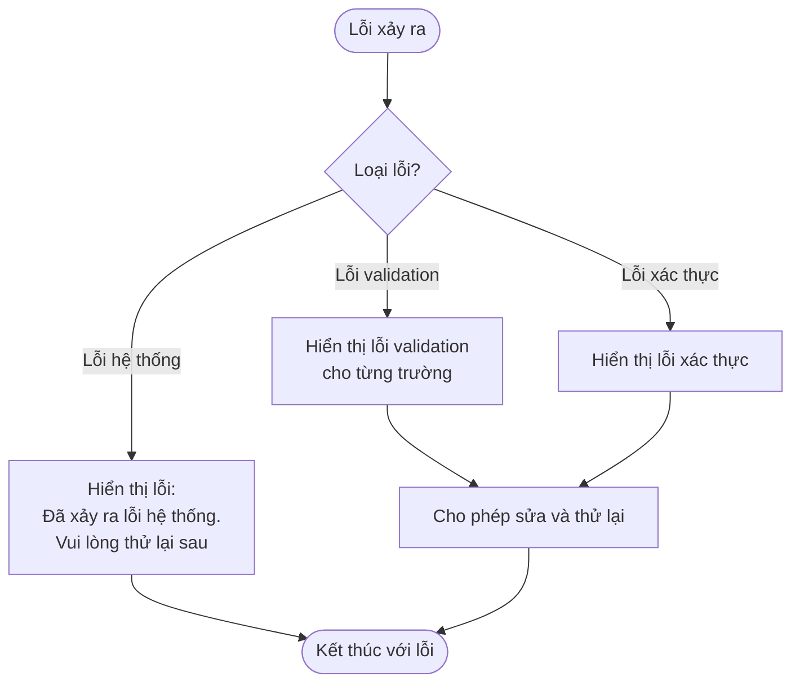

# 2.1.3 Hồ Sơ Cá Nhân (Personal Profile)

## Thông tin chung
- **Actor:** Độc giả
- **Yêu cầu:** Đăng nhập vào hệ thống với vai trò độc giả
- **Mô tả:** Cho phép độc giả xem và cập nhật thông tin cá nhân, thay đổi mật khẩu

## Luồng xem hồ sơ

## Luồng cập nhật thông tin cá nhân

## Luồng thay đổi mật khẩu

## Luồng thay thế

### Luồng 1: Người dùng chưa đăng nhập
- Hệ thống chuyển hướng đến trang đăng nhập
- Sau khi đăng nhập, quay lại trang hồ sơ

### Luồng 2: Người dùng không phải độc giả
- Hệ thống chuyển hướng đến dashboard phù hợp với vai trò

## Xử lý lỗi

## Quy tắc validation

### Cập nhật thông tin cá nhân
| Trường | Quy tắc |
|--------|---------|
| Tên | Không được để trống, tối đa 50 ký tự |
| Số điện thoại | Định dạng số điện thoại hợp lệ |
| Địa chỉ | Không được để trống, tối đa 255 ký tự |

### Thay đổi mật khẩu
| Trường | Quy tắc |
|--------|---------|
| Mật khẩu hiện tại | Bắt buộc, phải đúng với mật khẩu trong database |
| Mật khẩu mới | Không được để trống, tối thiểu 8 ký tự, tối đa 16 ký tự, phải khác mật khẩu cũ |
| Xác nhận mật khẩu mới | Phải trùng với mật khẩu mới |

## Thông tin hiển thị

### Thông tin cá nhân
- Tên
- Email (chỉ đọc, không thể thay đổi)
- Số điện thoại
- Địa chỉ

### Thống kê
- Ngày tham gia
- Số lần mượn
- Tổng số tiền phạt

