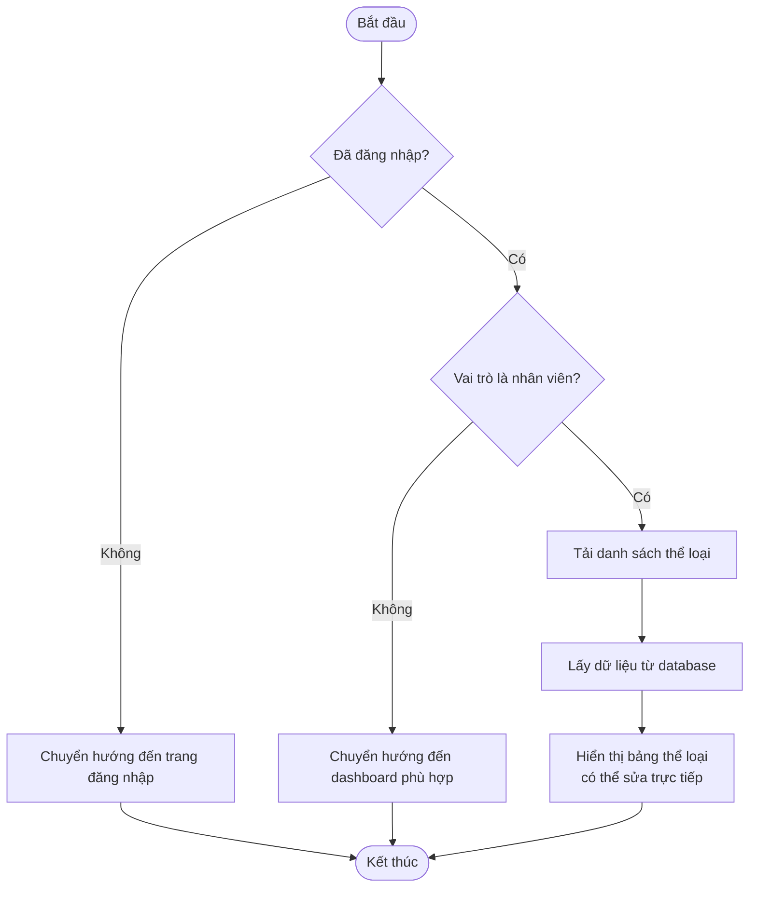
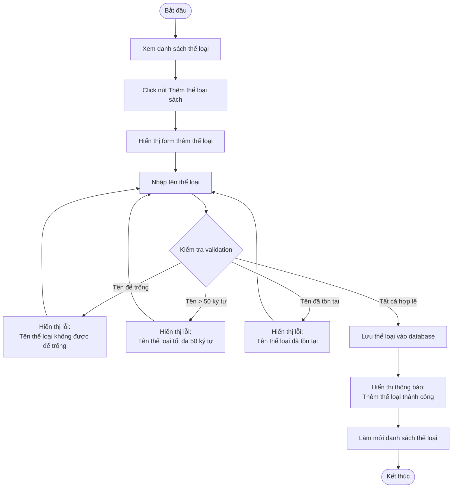
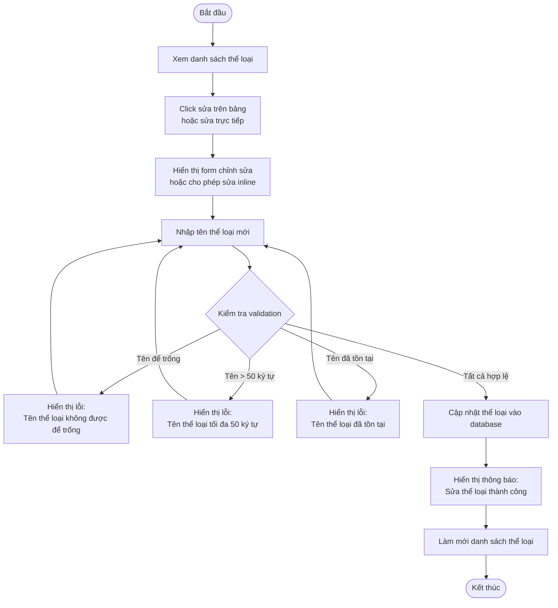
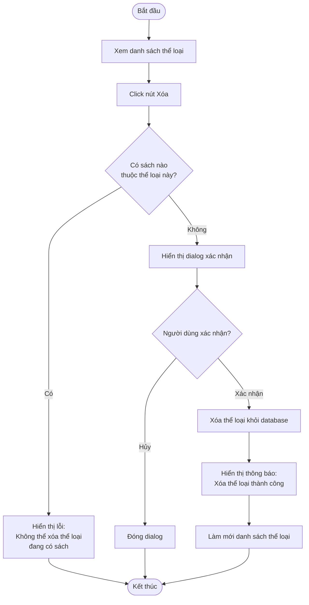
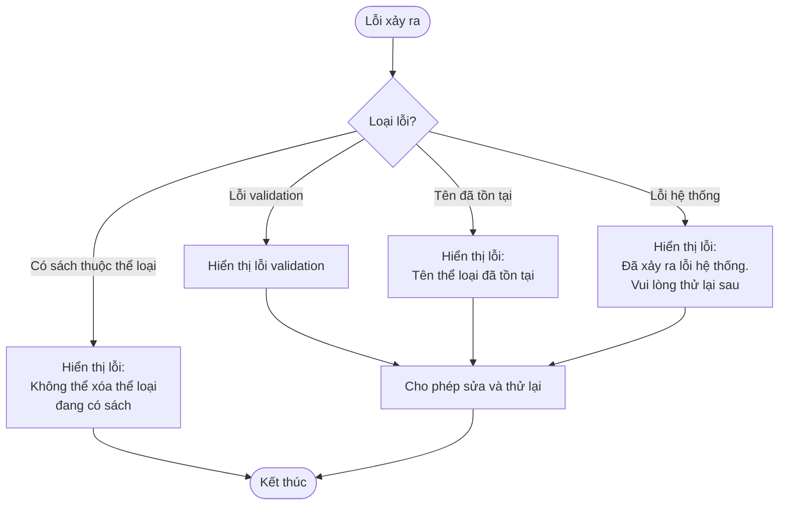

# 2.2.1 Quản lý thể loại sách (Book Category Management)

## Thông tin chung
- **Actor:** Nhân viên thư viện
- **Yêu cầu:** Đăng nhập vào hệ thống với vai trò nhân viên thư viện
- **Mô tả:** Cho phép nhân viên thư viện quản lý các thể loại sách (thêm, sửa, xóa)

## Luồng xem danh sách thể loại

## Luồng thêm thể loại mới

## Luồng sửa thể loại

## Luồng xóa thể loại

## Luồng thay thế

### Luồng 1: Người dùng chưa đăng nhập
- Hệ thống chuyển hướng đến trang đăng nhập

### Luồng 2: Người dùng không phải nhân viên
- Hệ thống chuyển hướng đến dashboard phù hợp với vai trò

### Luồng 3: Xóa thể loại có sách
- Hệ thống không cho phép xóa và hiển thị thông báo lỗi

### Luồng 4: Hủy thao tác
- Người dùng có thể hủy bất kỳ thao tác nào và quay lại danh sách

## Xử lý lỗi

## Quy tắc validation

| Trường | Quy tắc |
|--------|---------|
| Tên thể loại | Không được để trống, tối đa 50 ký tự, không được trùng với thể loại khác |

## Quy tắc nghiệp vụ

### Xóa thể loại
- Chỉ được xóa khi **không có sách nào** thuộc thể loại đó
- Phải có xác nhận từ người dùng trước khi xóa

### Sửa thể loại
- Có thể sửa trực tiếp trên bảng (inline editing)
- Hoặc sửa qua form riêng

## Giao diện

### Bảng thể loại
- Hiển thị: ID, Tên thể loại, Số lượng sách, Thao tác (Sửa/Xóa)
- Có thể sắp xếp và tìm kiếm
- Hỗ trợ sửa trực tiếp trên bảng

