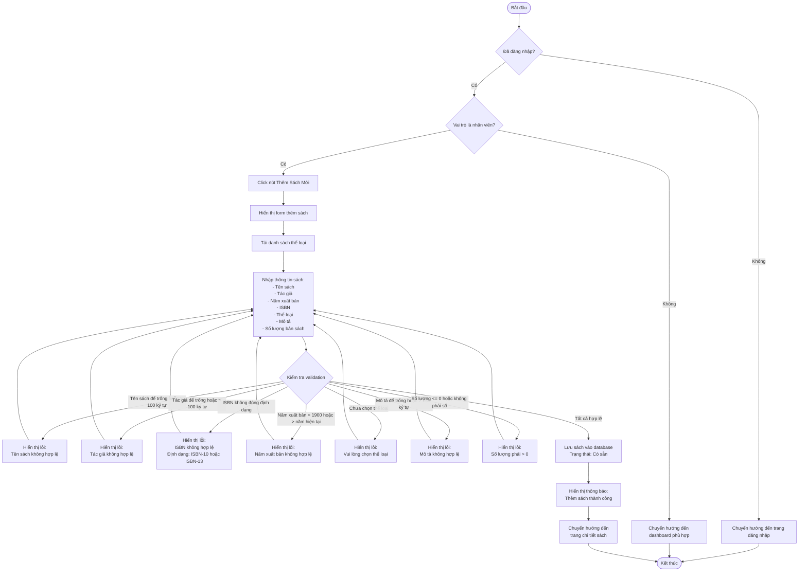
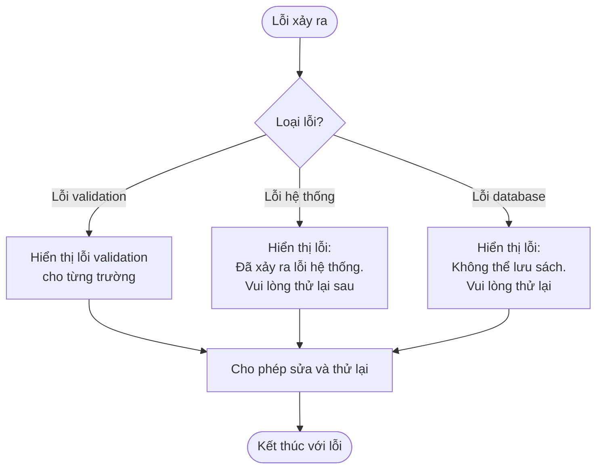

# 2.2.2 Thêm Sách Mới (Add New Book)

## Thông tin chung
- **Actor:** Nhân viên thư viện
- **Yêu cầu:** Đăng nhập vào hệ thống với vai trò nhân viên thư viện, đã có thể loại sách
- **Mô tả:** Cho phép nhân viên thư viện thêm sách mới vào hệ thống

## Luồng chính

## Luồng thay thế

### Luồng 1: Người dùng chưa đăng nhập
- Hệ thống chuyển hướng đến trang đăng nhập

### Luồng 2: Người dùng không phải nhân viên
- Hệ thống chuyển hướng đến dashboard phù hợp với vai trò

### Luồng 3: Chưa có thể loại sách
- Hệ thống yêu cầu tạo thể loại sách trước
- Chuyển hướng đến trang quản lý thể loại

### Luồng 4: Hủy thao tác
- Người dùng có thể hủy và quay lại danh sách sách

## Xử lý lỗi

## Quy tắc validation

| Trường | Quy tắc |
|--------|---------|
| Tên sách | Không được để trống, tối đa 100 ký tự |
| Tác giả | Không được để trống, tối đa 100 ký tự |
| Năm xuất bản | Năm hợp lệ (1900 - năm hiện tại) |
| ISBN | Định dạng chuẩn ISBN-10 hoặc ISBN-13 (nếu có, có thể để trống) |
| Thể loại | Bắt buộc chọn, phải là thể loại đã tồn tại |
| Mô tả | Không được để trống, tối đa 255 ký tự |
| Số lượng | Phải > 0, kiểu số nguyên |

## Trạng thái sau khi thêm

- Sách được tạo với trạng thái: **"Có sẵn"**
- Số lượng sách có sẵn = Số lượng nhập vào
- Số lượng sách đang mượn = 0

## Chi tiết kỹ thuật

### Dữ liệu lưu trữ
- Thông tin sách được lưu vào bảng `books`
- Số lượng được lưu trữ riêng để theo dõi:
  - `available_quantity`: Số lượng có sẵn
  - `borrowed_quantity`: Số lượng đang mượn
  - `total_quantity`: Tổng số lượng

### Liên kết với thể loại
- Mỗi sách phải thuộc một thể loại
- Sử dụng foreign key để đảm bảo tính toàn vẹn dữ liệu

