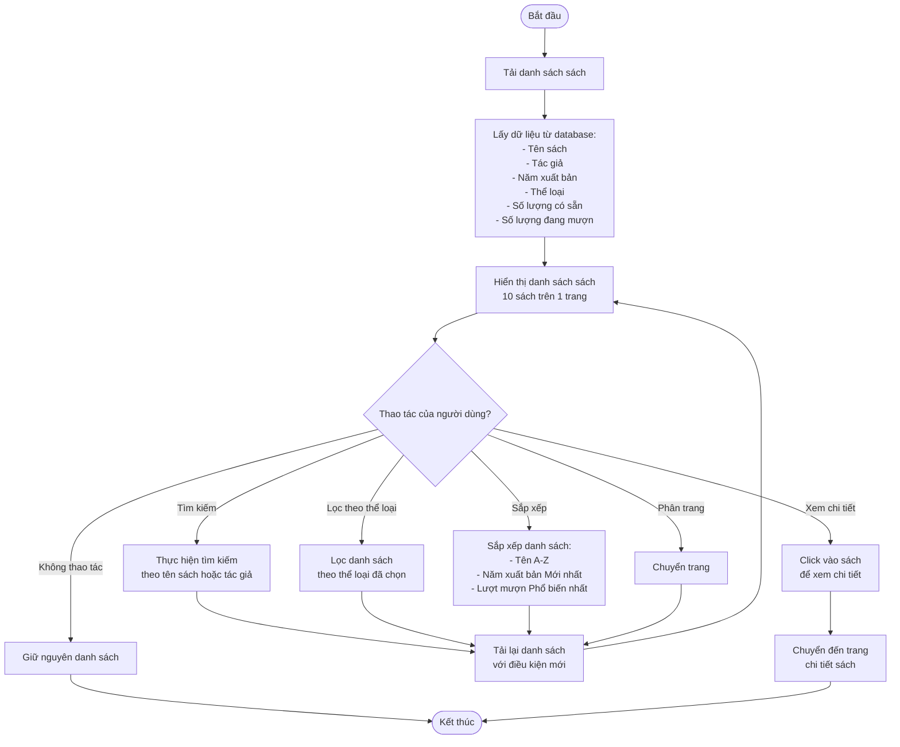
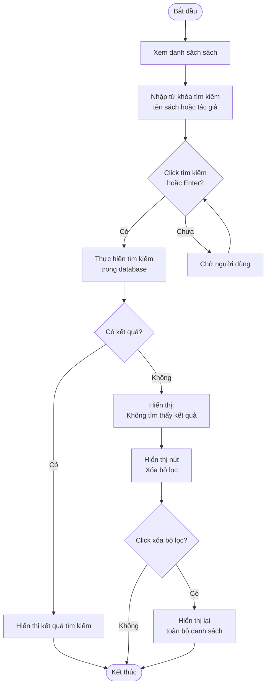
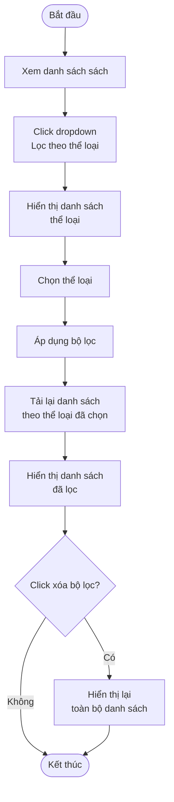
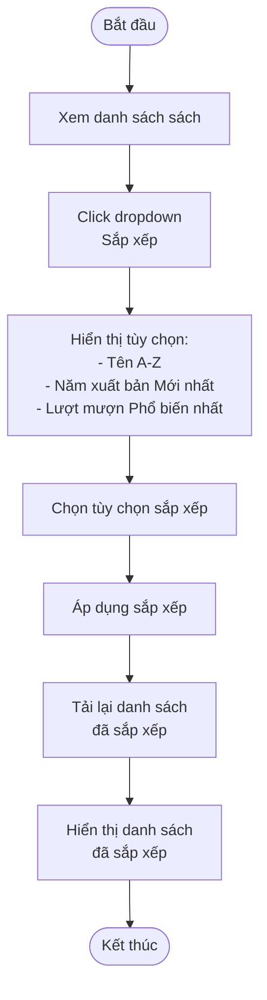
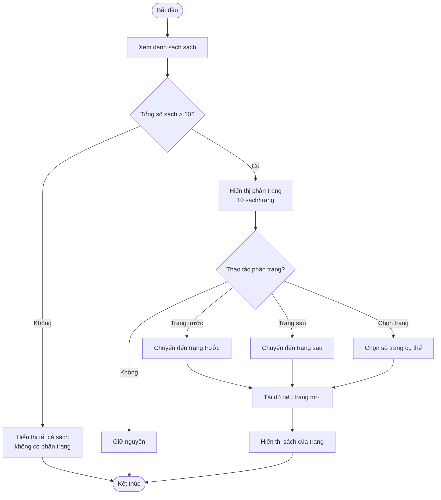
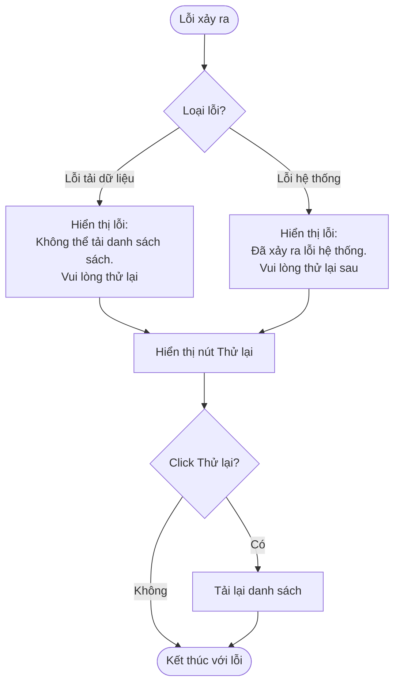

# 2.2.3 Xem Danh Sách Sách (View Book List)

## Thông tin chung
- **Actor:** Tất cả người dùng (không cần đăng nhập)
- **Yêu cầu:** Không có
- **Mô tả:** Cho phép mọi người xem danh sách sách với các chức năng tìm kiếm, lọc, sắp xếp và phân trang

## Luồng chính

## Luồng tìm kiếm

## Luồng lọc theo thể loại

## Luồng sắp xếp

## Luồng phân trang

## Luồng thay thế

### Luồng 1: Không có sách nào
- Hiển thị thông báo "Chưa có sách nào trong hệ thống"

### Luồng 2: Tìm kiếm không có kết quả
- Hiển thị thông báo "Không tìm thấy sách phù hợp"
- Cung cấp nút để xóa bộ lọc và xem lại toàn bộ danh sách

### Luồng 3: Lọc không có kết quả
- Hiển thị thông báo "Không có sách nào thuộc thể loại này"

## Xử lý lỗi

## Thông tin hiển thị

### Mỗi sách trong danh sách hiển thị:
- Tên sách
- Tác giả
- Năm xuất bản
- Thể loại
- Số lượng có sẵn
- Số lượng đang mượn

### Phân trang:
- 10 sách trên 1 trang
- Hiển thị số trang hiện tại và tổng số trang
- Có nút chuyển trang (Trước/Sau) và chọn trang cụ thể

## Chức năng tìm kiếm & lọc

### Tìm kiếm:
- Tìm theo **tên sách** hoặc **tác giả**
- Tìm kiếm không phân biệt hoa thường
- Tìm kiếm một phần (partial match)

### Lọc:
- Lọc theo **thể loại**
- Có thể kết hợp với tìm kiếm

### Sắp xếp:
- **Tên (A-Z)**: Sắp xếp theo tên sách tăng dần
- **Năm xuất bản (Mới nhất)**: Sắp xếp theo năm xuất bản giảm dần
- **Lượt mượn (Phổ biến nhất)**: Sắp xếp theo số lượt mượn giảm dần

