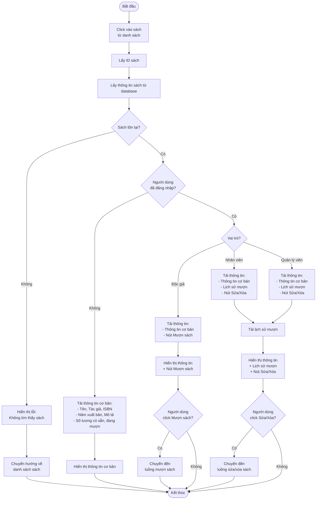
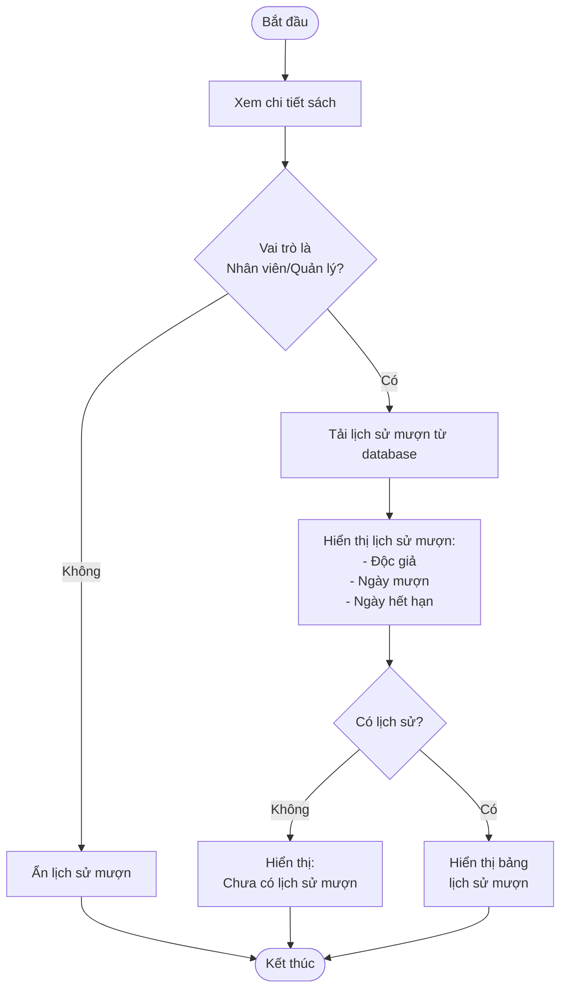
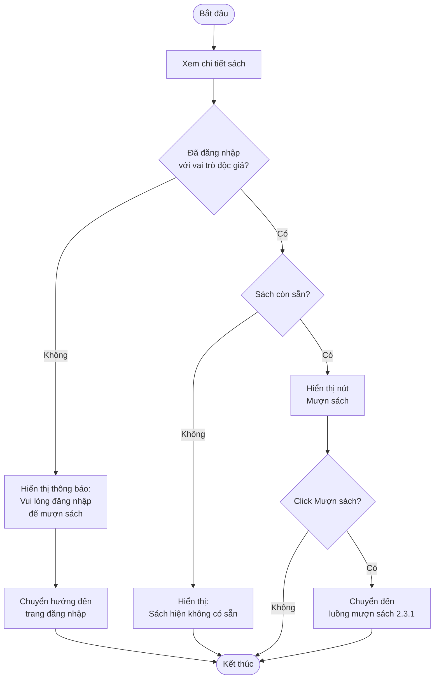
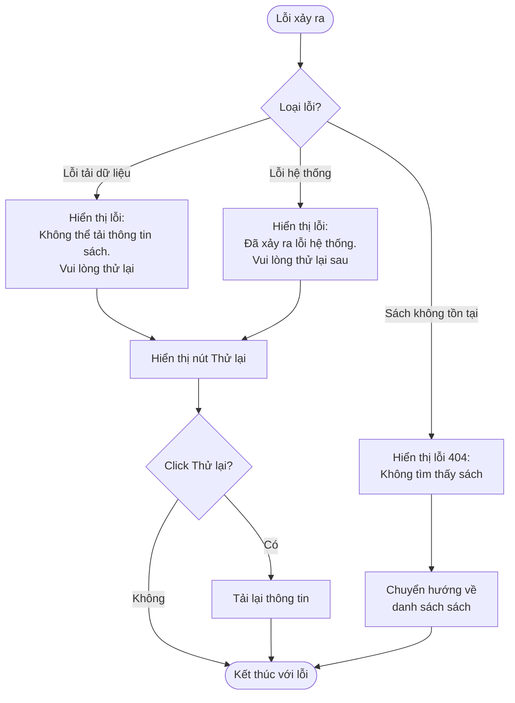

# 2.2.4 Xem Chi Tiết Sách (View Book Details)

## Thông tin chung
- **Actor:** Tất cả người dùng (không cần đăng nhập)
- **Yêu cầu:** Không có (nhưng cần có danh sách sách)
- **Mô tả:** Cho phép mọi người xem thông tin chi tiết của một cuốn sách, bao gồm lịch sử mượn (nếu là nhân viên)

## Luồng chính

## Luồng xem lịch sử mượn (Nhân viên/Quản lý viên)

## Luồng mượn sách (Độc giả)

## Luồng thay thế

### Luồng 1: Sách không tồn tại
- Hiển thị lỗi 404
- Chuyển hướng về danh sách sách

### Luồng 2: Người dùng chưa đăng nhập
- Hiển thị thông tin cơ bản
- Ẩn nút "Mượn sách" hoặc hiển thị thông báo yêu cầu đăng nhập

### Luồng 3: Sách không còn sẵn
- Hiển thị thông báo "Sách hiện không có sẵn"
- Ẩn hoặc vô hiệu hóa nút "Mượn sách"

## Xử lý lỗi

## Thông tin hiển thị

### Thông tin cơ bản (Tất cả người dùng):
- Tên sách
- Tác giả
- ISBN
- Năm xuất bản
- Mô tả chi tiết
- Số lượng bản đang có
- Số lượng bản đang mượn

### Lịch sử mượn (Chỉ Nhân viên/Quản lý viên):
- Độc giả (Tên, Email)
- Ngày mượn
- Ngày hết hạn

### Thao tác theo vai trò:

#### Độc giả (đã đăng nhập):
- Nút "Mượn sách" (nếu sách còn sẵn)

#### Nhân viên/Quản lý viên:
- Nút "Sửa"
- Nút "Xóa"
- Xem lịch sử mượn

#### Người dùng chưa đăng nhập:
- Chỉ xem thông tin, không có thao tác

## Quy tắc hiển thị

### Nút "Mượn sách":
- Chỉ hiển thị khi:
  - Người dùng đã đăng nhập với vai trò độc giả
  - Sách còn sẵn (số lượng > 0)

### Lịch sử mượn:
- Chỉ hiển thị cho nhân viên và quản lý viên
- Hiển thị tất cả các đơn mượn của sách này (đã mượn, đang mượn, đã trả)

