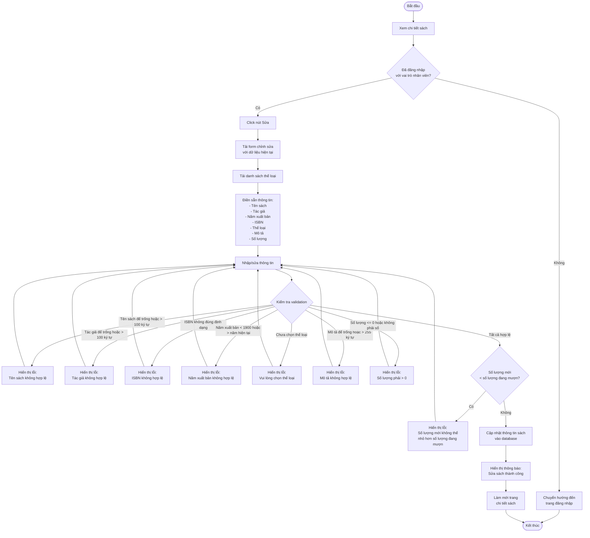
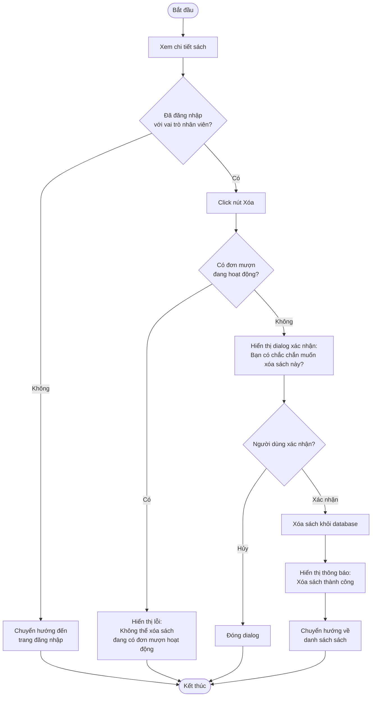
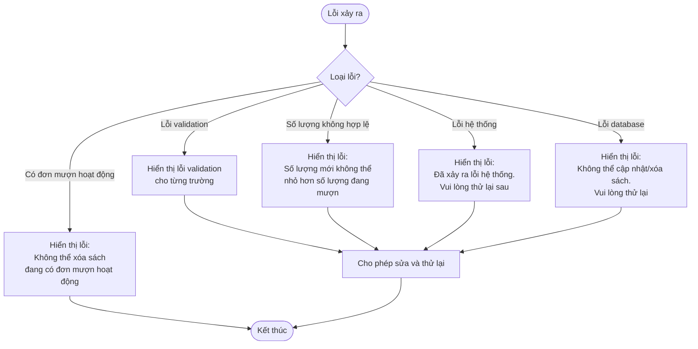

# 2.2.5 Sửa & Xóa Sách (Edit & Delete Book)

## Thông tin chung
- **Actor:** Nhân viên thư viện
- **Yêu cầu:** Đăng nhập vào hệ thống với vai trò nhân viên thư viện, đã xem chi tiết sách
- **Mô tả:** Cho phép nhân viên thư viện sửa và xóa sách trong hệ thống

## Luồng sửa sách

## Luồng xóa sách

## Luồng thay thế

### Luồng 1: Người dùng chưa đăng nhập
- Hệ thống chuyển hướng đến trang đăng nhập
- Sau khi đăng nhập, quay lại trang chi tiết sách

### Luồng 2: Người dùng không phải nhân viên
- Hệ thống chuyển hướng đến dashboard phù hợp với vai trò

### Luồng 3: Sửa số lượng nhỏ hơn số lượng đang mượn
- Hệ thống không cho phép và hiển thị lỗi
- Người dùng phải điều chỉnh số lượng

### Luồng 4: Xóa sách có đơn mượn hoạt động
- Hệ thống không cho phép xóa
- Hiển thị thông báo lỗi

### Luồng 5: Hủy thao tác
- Người dùng có thể hủy bất kỳ thao tác nào và quay lại trang chi tiết

## Xử lý lỗi

## Quy tắc validation

### Sửa sách:
| Trường | Quy tắc |
|--------|---------|
| Tên sách | Không được để trống, tối đa 100 ký tự |
| Tác giả | Không được để trống, tối đa 100 ký tự |
| Năm xuất bản | Năm hợp lệ (1900 - năm hiện tại) |
| ISBN | Định dạng chuẩn ISBN-10 hoặc ISBN-13 (nếu có) |
| Thể loại | Bắt buộc chọn, phải là thể loại đã tồn tại |
| Mô tả | Không được để trống, tối đa 255 ký tự |
| Số lượng | Phải > 0, kiểu số nguyên, **không được nhỏ hơn số lượng đang mượn** |

### Xóa sách:
- Chỉ được xóa khi **không có đơn mượn hoạt động**
- Phải có xác nhận từ người dùng trước khi xóa

## Quy tắc nghiệp vụ

### Sửa số lượng:
- Số lượng mới phải >= số lượng đang mượn
- Nếu giảm số lượng, số lượng có sẵn sẽ tự động điều chỉnh
- Công thức: `available_quantity = total_quantity - borrowed_quantity`

### Xóa sách:
- Kiểm tra tất cả đơn mượn liên quan đến sách
- Chỉ cho phép xóa nếu không có đơn mượn ở trạng thái:
  - "Chờ xác nhận"
  - "Đang mượn"
  - "Quá hạn"

## Chi tiết kỹ thuật

### Cập nhật sách:
- Cập nhật tất cả các trường được chỉnh sửa
- Tự động tính lại `available_quantity` nếu `total_quantity` thay đổi
- Giữ nguyên `borrowed_quantity` nếu không có thay đổi về đơn mượn

### Xóa sách:
- Soft delete hoặc hard delete (tùy theo thiết kế database)
- Nếu soft delete: đánh dấu `deleted_at` và ẩn khỏi danh sách
- Nếu hard delete: xóa hoàn toàn khỏi database (cần cẩn thận với foreign keys)

