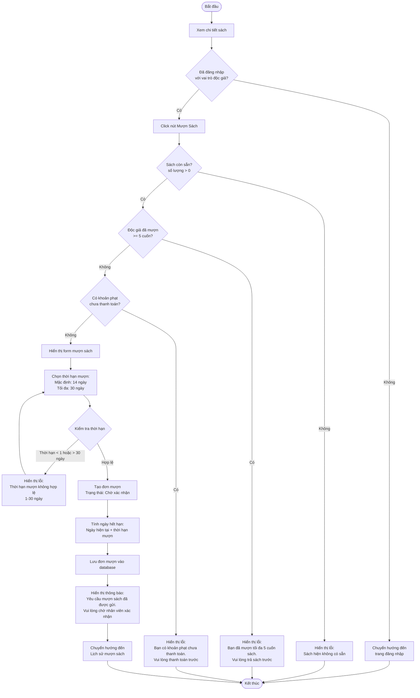
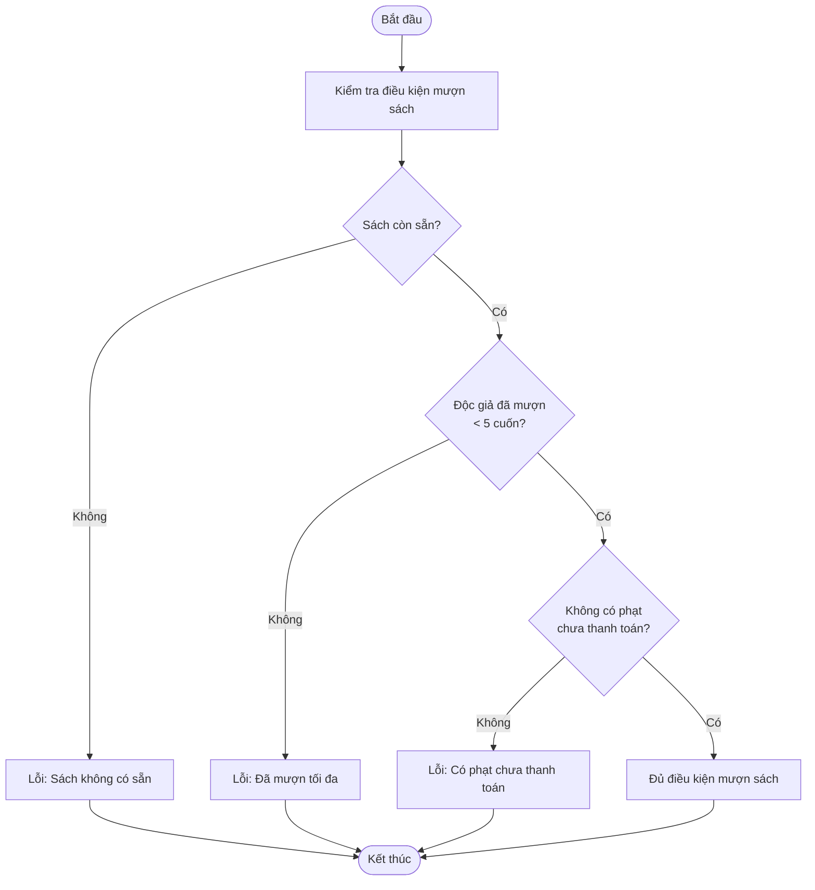
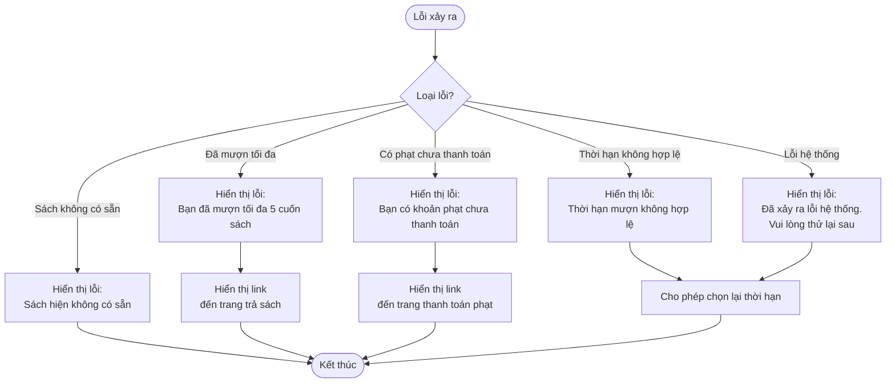

# 2.3.1 Mượn Sách (Độc Giả) - Borrow Book (Reader)

## Thông tin chung
- **Actor:** Độc giả
- **Yêu cầu:** Đăng nhập vào hệ thống với vai trò độc giả, đã xem chi tiết sách
- **Mô tả:** Cho phép độc giả tạo yêu cầu mượn sách

## Điều kiện tiên quyết

1. **Sách còn sẵn**: Số lượng sách có sẵn > 0
2. **Không vượt quá giới hạn**: Độc giả chưa mượn quá số sách tối đa (mặc định 5 cuốn)
3. **Không có khoản phạt chưa thanh toán**: Tất cả các khoản phạt phải đã được thanh toán

## Luồng chính



## Luồng kiểm tra điều kiện chi tiết



## Luồng thay thế

### Luồng 1: Người dùng chưa đăng nhập
- Hệ thống chuyển hướng đến trang đăng nhập
- Sau khi đăng nhập, quay lại trang chi tiết sách

### Luồng 2: Sách không còn sẵn
- Hiển thị thông báo "Sách hiện không có sẵn"
- Vô hiệu hóa nút "Mượn sách"

### Luồng 3: Đã mượn tối đa số sách
- Hiển thị thông báo lỗi
- Gợi ý trả sách trước khi mượn sách mới

### Luồng 4: Có khoản phạt chưa thanh toán
- Hiển thị thông báo lỗi
- Cung cấp link đến trang thanh toán phạt

### Luồng 5: Hủy thao tác
- Người dùng có thể hủy và quay lại trang chi tiết sách

## Xử lý lỗi



## Quy tắc validation

| Trường | Quy tắc |
|--------|---------|
| Thời hạn mượn | Tối thiểu 1 ngày, tối đa 30 ngày, mặc định 14 ngày |

## Quy tắc nghiệp vụ

### Điều kiện mượn sách:
1. **Sách còn sẵn**: `available_quantity > 0`
2. **Không vượt quá giới hạn**: Số sách đang mượn (trạng thái "Đang mượn") < 5
3. **Không có phạt chưa thanh toán**: Tất cả phiếu phạt có `status != "Đã thanh toán"` phải = 0

### Thời hạn mượn:
- **Mặc định**: 14 ngày
- **Tối thiểu**: 1 ngày
- **Tối đa**: 30 ngày

### Trạng thái đơn mượn:
- Sau khi tạo: **"Chờ xác nhận"**
- Đợi nhân viên xác nhận (xem 2.3.2)

## Chi tiết kỹ thuật

### Dữ liệu đơn mượn:
- `book_id`: ID sách
- `reader_id`: ID độc giả
- `borrow_date`: Ngày mượn (ngày hiện tại)
- `due_date`: Ngày hết hạn (ngày hiện tại + thời hạn mượn)
- `status`: "Chờ xác nhận"
- `duration_days`: Số ngày mượn

### Tính ngày hết hạn:
```
due_date = current_date + duration_days
```

### Kiểm tra số sách đang mượn:
```sql
SELECT COUNT(*) 
FROM borrows 
WHERE reader_id = ? 
  AND status IN ('Chờ xác nhận', 'Đang mượn', 'Quá hạn')
```

### Kiểm tra phạt chưa thanh toán:
```sql
SELECT COUNT(*) 
FROM fines 
WHERE reader_id = ? 
  AND status != 'Đã thanh toán'
```

