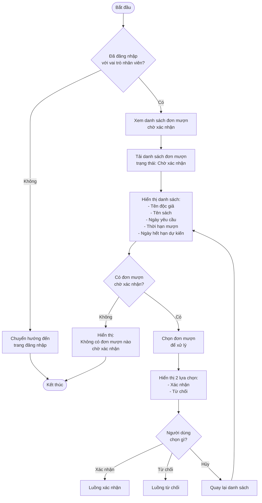
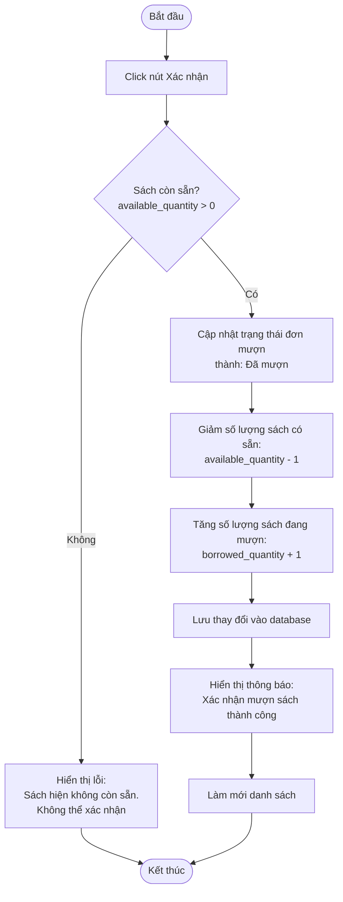
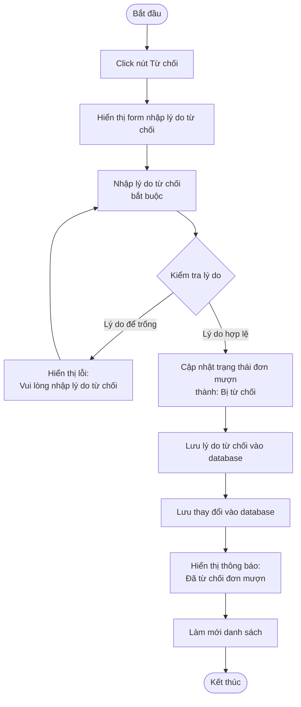
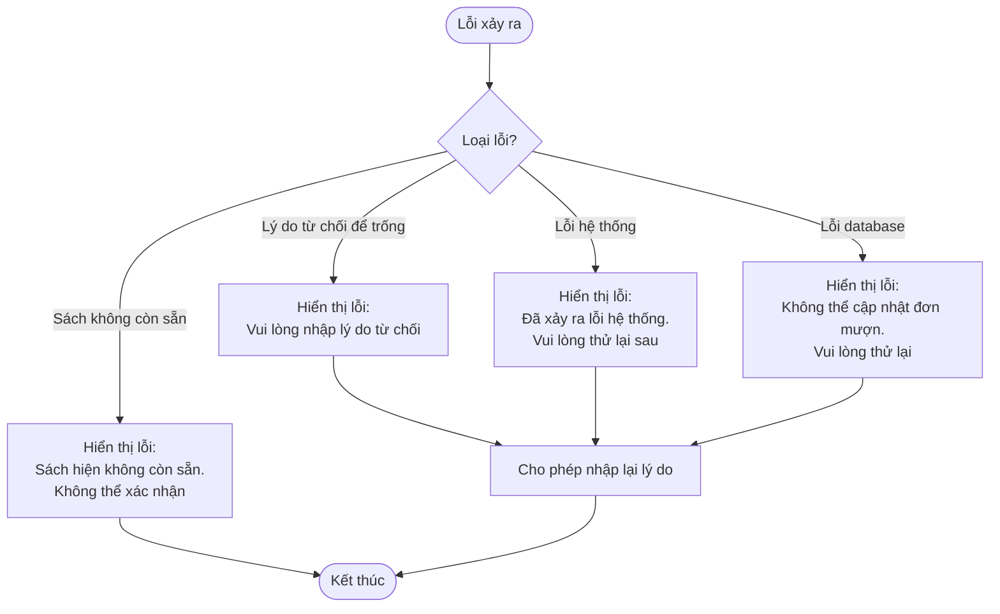

# 2.3.2 Mượn Sách (Nhân Viên Thư Viện) - Borrow Book (Librarian)

## Thông tin chung
- **Actor:** Nhân viên thư viện
- **Yêu cầu:** Đăng nhập vào hệ thống với vai trò nhân viên thư viện
- **Mô tả:** Cho phép nhân viên thư viện xem và xử lý các yêu cầu mượn sách (xác nhận hoặc từ chối)

## Luồng chính



## Luồng xác nhận đơn mượn



## Luồng từ chối đơn mượn



## Luồng thay thế

### Luồng 1: Người dùng chưa đăng nhập
- Hệ thống chuyển hướng đến trang đăng nhập

### Luồng 2: Người dùng không phải nhân viên
- Hệ thống chuyển hướng đến dashboard phù hợp với vai trò

### Luồng 3: Không có đơn mượn chờ xác nhận
- Hiển thị thông báo "Không có đơn mượn nào chờ xác nhận"

### Luồng 4: Xác nhận nhưng sách không còn sẵn
- Hiển thị lỗi và không cho phép xác nhận
- Gợi ý kiểm tra lại số lượng sách

### Luồng 5: Hủy nhập lý do từ chối
- Người dùng có thể hủy và quay lại danh sách

## Xử lý lỗi



## Quy tắc validation

| Trường | Quy tắc |
|--------|---------|
| Lý do từ chối | Bắt buộc, không được để trống, tối đa 500 ký tự |

## Quy tắc nghiệp vụ

### Xác nhận đơn mượn:
1. Kiểm tra sách còn sẵn trước khi xác nhận
2. Cập nhật trạng thái: "Chờ xác nhận" → "Đã mượn"
3. Giảm `available_quantity` của sách đi 1
4. Tăng `borrowed_quantity` của sách lên 1

### Từ chối đơn mượn:
1. Bắt buộc phải nhập lý do từ chối
2. Cập nhật trạng thái: "Chờ xác nhận" → "Bị từ chối"
3. Lưu lý do từ chối để độc giả có thể xem (xem 2.3.3)
4. Không thay đổi số lượng sách

### Kiểm tra sách còn sẵn:
- Trước khi xác nhận, phải kiểm tra lại `available_quantity > 0`
- Có thể sách đã bị mượn bởi người khác trong lúc chờ xác nhận

## Chi tiết kỹ thuật

### Cập nhật số lượng sách khi xác nhận:
```sql
UPDATE books 
SET available_quantity = available_quantity - 1,
    borrowed_quantity = borrowed_quantity + 1
WHERE id = ? AND available_quantity > 0
```

### Cập nhật trạng thái đơn mượn:
```sql
UPDATE borrows 
SET status = 'Đã mượn',
    confirmed_at = NOW(),
    confirmed_by = ?
WHERE id = ? AND status = 'Chờ xác nhận'
```

### Từ chối đơn mượn:
```sql
UPDATE borrows 
SET status = 'Bị từ chối',
    rejection_reason = ?,
    rejected_at = NOW(),
    rejected_by = ?
WHERE id = ? AND status = 'Chờ xác nhận'
```

## Thông tin hiển thị trong danh sách

### Mỗi đơn mượn hiển thị:
- Tên độc giả
- Email độc giả
- Tên sách
- Tác giả
- Ngày yêu cầu mượn
- Thời hạn mượn (số ngày)
- Ngày hết hạn dự kiến
- Nút "Xác nhận" và "Từ chối"

