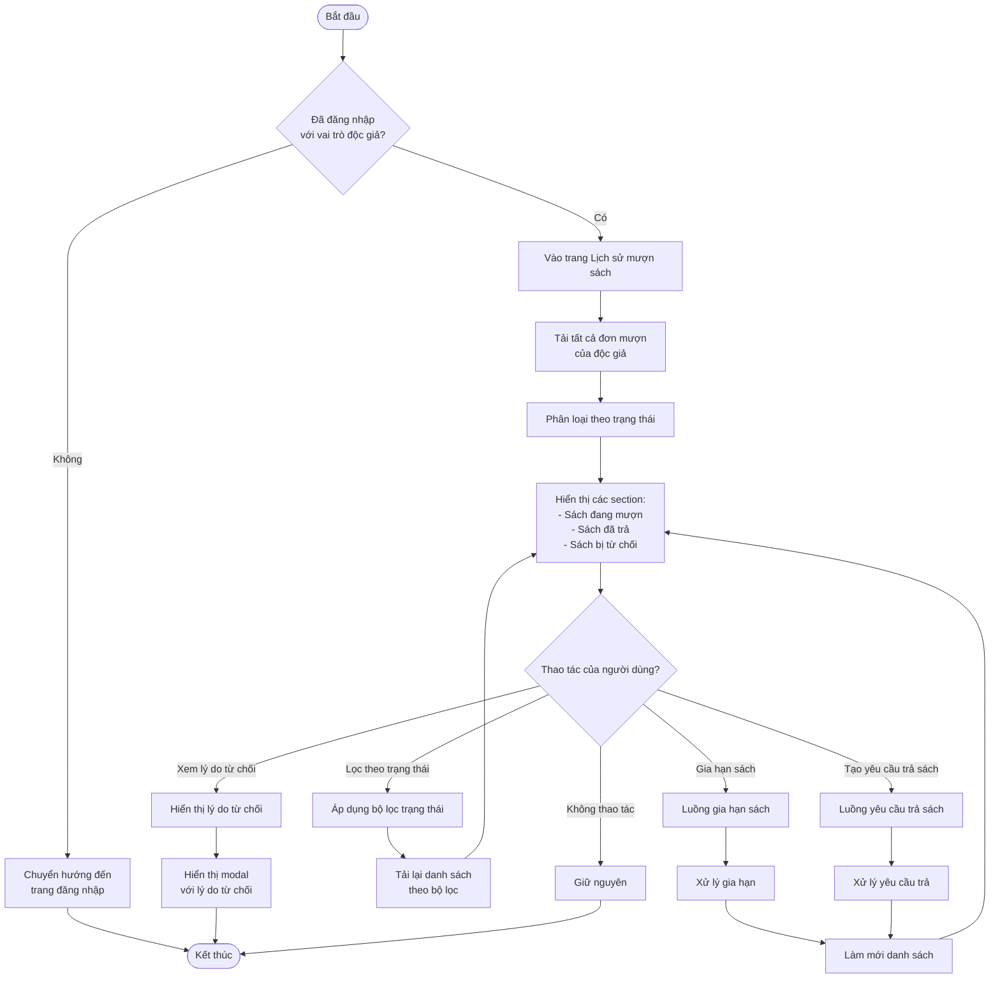
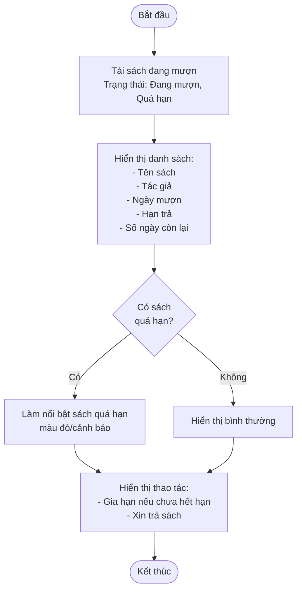
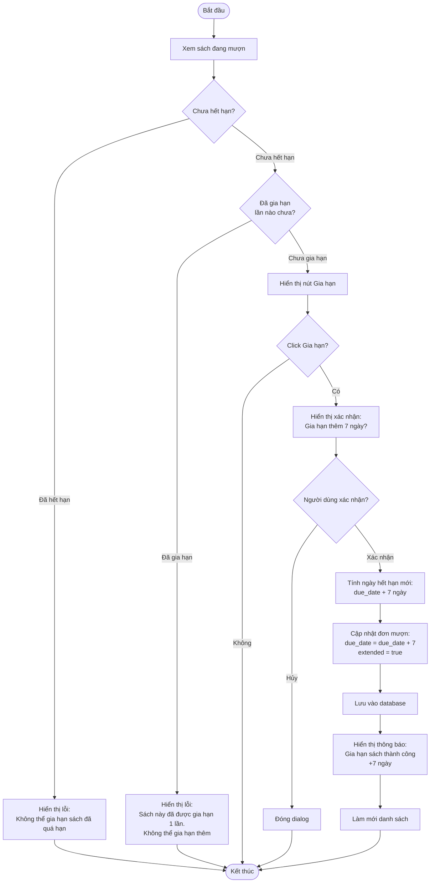
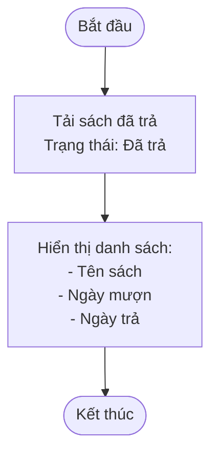
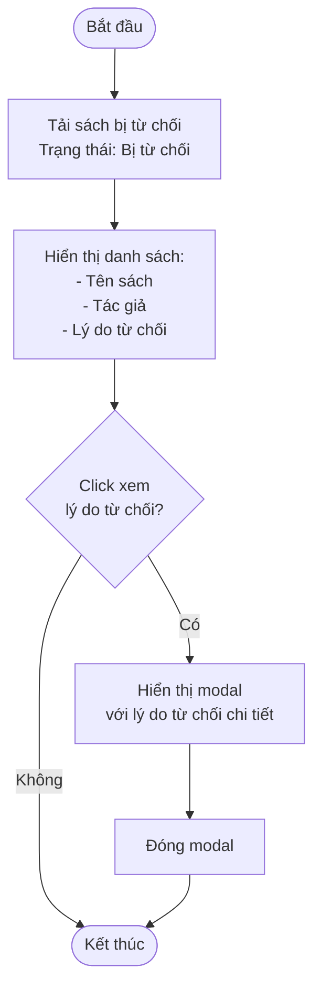
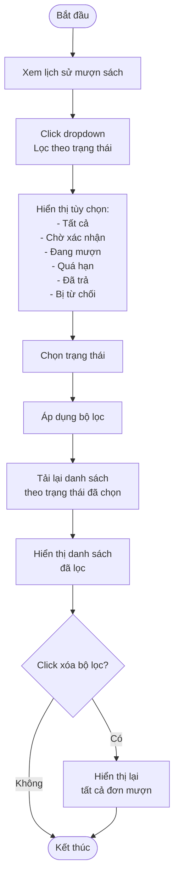
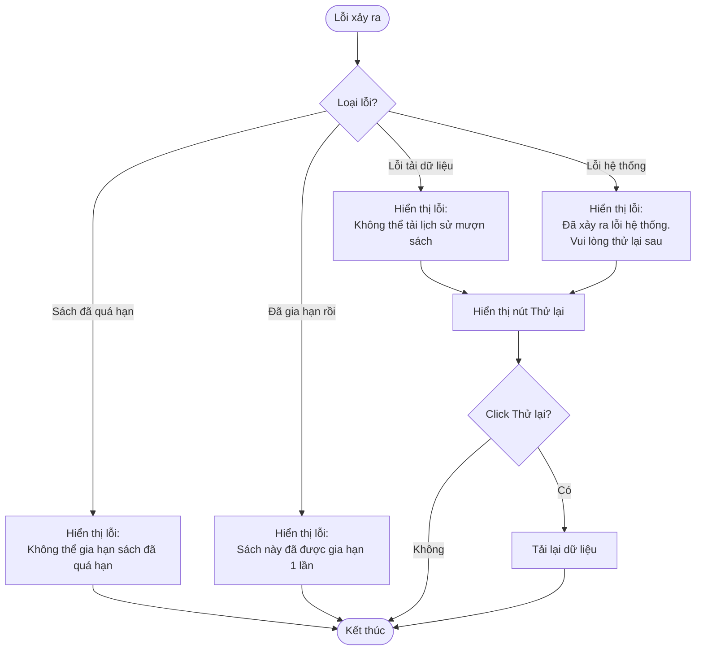

# 2.3.3 Xem Lịch Sử Mượn Sách (View Borrowing History)

## Thông tin chung
- **Actor:** Độc giả
- **Yêu cầu:** Đăng nhập vào hệ thống với vai trò độc giả, đã có đơn mượn
- **Mô tả:** Cho phép độc giả xem lịch sử mượn sách, lọc theo trạng thái, gia hạn sách và tạo yêu cầu trả sách

## Luồng chính



## Luồng hiển thị sách đang mượn



## Luồng gia hạn sách



## Luồng xem sách đã trả



## Luồng xem sách bị từ chối



## Luồng lọc theo trạng thái



## Luồng thay thế

### Luồng 1: Người dùng chưa đăng nhập
- Hệ thống chuyển hướng đến trang đăng nhập

### Luồng 2: Chưa có đơn mượn nào
- Hiển thị thông báo "Bạn chưa có đơn mượn nào"

### Luồng 3: Gia hạn sách đã quá hạn
- Không cho phép gia hạn và hiển thị lỗi

### Luồng 4: Gia hạn sách đã được gia hạn
- Không cho phép gia hạn thêm và hiển thị lỗi

## Xử lý lỗi



## Quy tắc nghiệp vụ

### Gia hạn sách:
- Chỉ được gia hạn khi sách **chưa hết hạn**
- Chỉ được gia hạn **1 lần** cho mỗi đơn mượn
- Gia hạn thêm **7 ngày** từ ngày hết hạn hiện tại
- Công thức: `new_due_date = current_due_date + 7 days`

### Trạng thái đơn mượn:
- **"Chờ xác nhận"**: Đang chờ nhân viên xác nhận
- **"Đang mượn"**: Đã được xác nhận, chưa đến hạn trả
- **"Quá hạn"**: Đã quá ngày hết hạn nhưng chưa trả
- **"Đã trả"**: Đã trả sách
- **"Bị từ chối"**: Bị nhân viên từ chối

## Thông tin hiển thị

### Sách đang mượn:
- Tên sách
- Tác giả
- Ngày mượn
- Hạn trả
- Số ngày còn lại (hoặc số ngày quá hạn)
- Nút "Gia hạn" (nếu chưa hết hạn và chưa gia hạn)
- Nút "Xin trả sách"

### Sách đã trả:
- Tên sách
- Ngày mượn
- Ngày trả

### Sách bị từ chối:
- Tên sách
- Tác giả
- Lý do từ chối (có thể click để xem chi tiết)

## Chi tiết kỹ thuật

### Tính số ngày còn lại:
```javascript
const daysRemaining = (dueDate - currentDate) / (1000 * 60 * 60 * 24)
if (daysRemaining < 0) {
  // Sách đã quá hạn
  status = "Quá hạn"
}
```

### Cập nhật gia hạn:
```sql
UPDATE borrows 
SET due_date = due_date + INTERVAL '7 days',
    extended = true,
    extended_at = NOW()
WHERE id = ? 
  AND status = 'Đang mượn'
  AND due_date > NOW()
  AND extended = false
```

