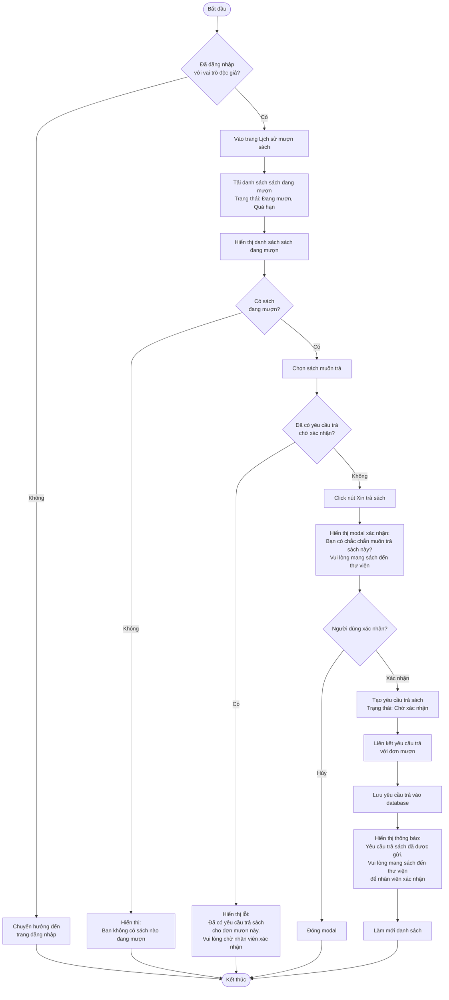
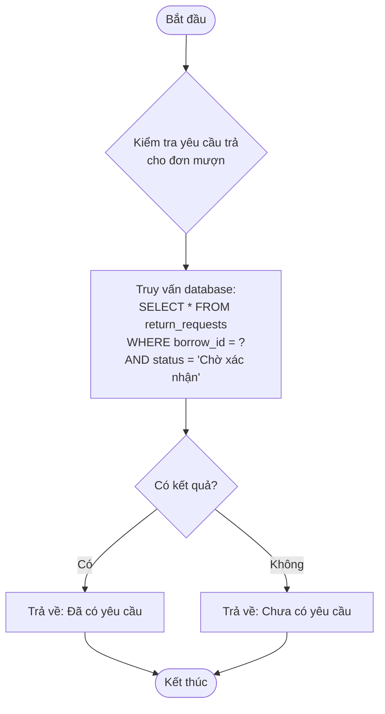
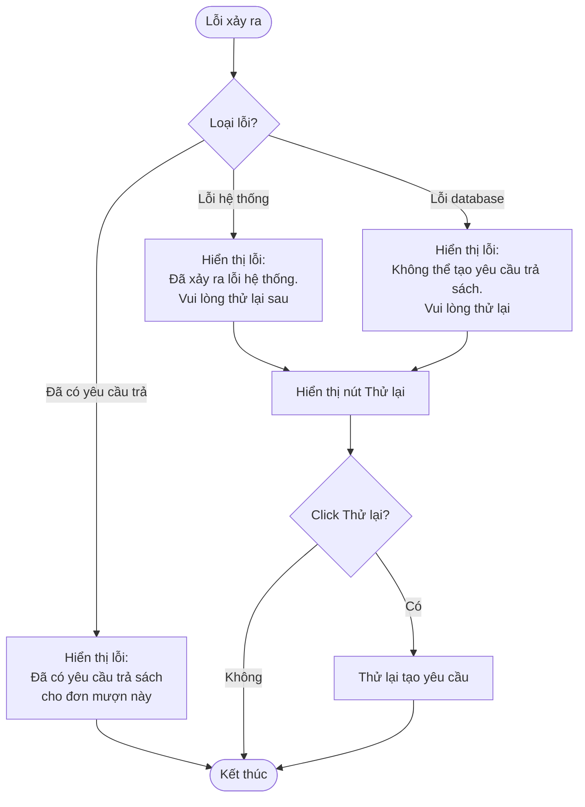

# 2.4.1 Yêu Cầu Trả Sách (Return Request)

## Thông tin chung
- **Actor:** Độc giả
- **Yêu cầu:** Đăng nhập vào hệ thống với vai trò độc giả, có sách đang mượn
- **Mô tả:** Cho phép độc giả tạo yêu cầu trả sách cho các sách đang mượn

## Luồng chính



## Luồng kiểm tra yêu cầu trả đã tồn tại



## Luồng thay thế

### Luồng 1: Người dùng chưa đăng nhập
- Hệ thống chuyển hướng đến trang đăng nhập
- Sau khi đăng nhập, quay lại trang lịch sử mượn sách

### Luồng 2: Không có sách đang mượn
- Hiển thị thông báo "Bạn không có sách nào đang mượn"
- Ẩn nút "Xin trả sách"

### Luồng 3: Đã có yêu cầu trả chờ xác nhận
- Hiển thị lỗi và không cho phép tạo yêu cầu mới
- Gợi ý chờ nhân viên xác nhận yêu cầu hiện tại

### Luồng 4: Hủy thao tác
- Người dùng có thể hủy và quay lại danh sách

## Xử lý lỗi



## Quy tắc nghiệp vụ

### Điều kiện tạo yêu cầu trả:
1. **Có sách đang mượn**: Đơn mượn ở trạng thái "Đang mượn" hoặc "Quá hạn"
2. **Chưa có yêu cầu trả chờ xác nhận**: Một đơn mượn chỉ có thể có **1 yêu cầu trả** ở trạng thái "Chờ xác nhận"

### Trạng thái yêu cầu trả:
- **"Chờ xác nhận"**: Độc giả đã gửi yêu cầu, chờ nhân viên xác nhận
- Sau khi nhân viên xác nhận, yêu cầu trả sẽ được xử lý (xem 2.4.2)

### Lưu ý:
- Độc giả cần **mang sách đến thư viện** để nhân viên xác nhận
- Yêu cầu trả chỉ là thông báo trước, không tự động trả sách

## Chi tiết kỹ thuật

### Dữ liệu yêu cầu trả:
- `borrow_id`: ID đơn mượn
- `reader_id`: ID độc giả
- `request_date`: Ngày tạo yêu cầu
- `status`: "Chờ xác nhận"
- `notes`: Ghi chú (nếu có)

### Kiểm tra yêu cầu trả đã tồn tại:
```sql
SELECT COUNT(*) 
FROM return_requests 
WHERE borrow_id = ? 
  AND status = 'Chờ xác nhận'
```

### Tạo yêu cầu trả:
```sql
INSERT INTO return_requests (
  borrow_id, 
  reader_id, 
  request_date, 
  status
) VALUES (?, ?, NOW(), 'Chờ xác nhận')
```

### Ràng buộc:
- Một đơn mượn chỉ có thể có **1 yêu cầu trả** ở trạng thái "Chờ xác nhận" tại một thời điểm
- Có thể có nhiều yêu cầu trả cho cùng một đơn mượn nếu các yêu cầu trước đã được xử lý

## Thông tin hiển thị

### Trong danh sách sách đang mượn:
- Hiển thị nút "Xin trả sách" cho mỗi sách đang mượn
- Nếu đã có yêu cầu trả chờ xác nhận, hiển thị:
  - Trạng thái: "Đang chờ xác nhận trả"
  - Ẩn hoặc vô hiệu hóa nút "Xin trả sách"

### Modal xác nhận:
- Tiêu đề: "Xác nhận trả sách"
- Nội dung: 
  - Tên sách
  - Thông báo: "Bạn có chắc chắn muốn trả sách này?"
  - Lưu ý: "Vui lòng mang sách đến thư viện để nhân viên xác nhận"
- Nút: "Xác nhận" và "Hủy"

