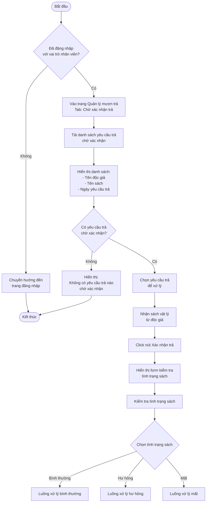
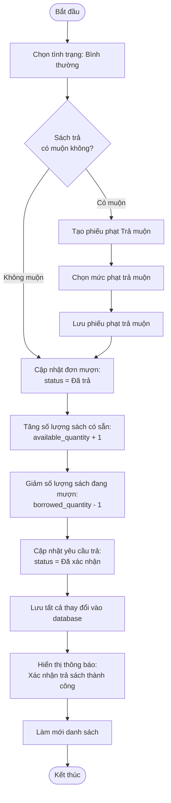
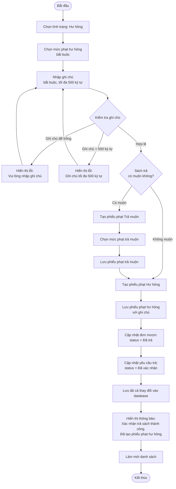
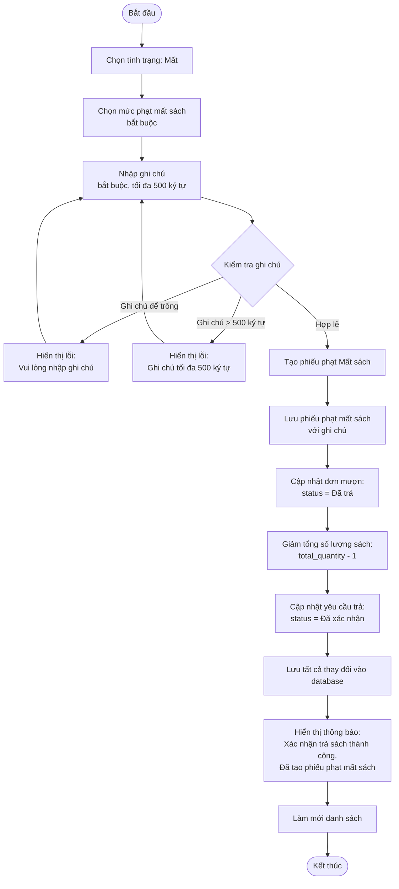
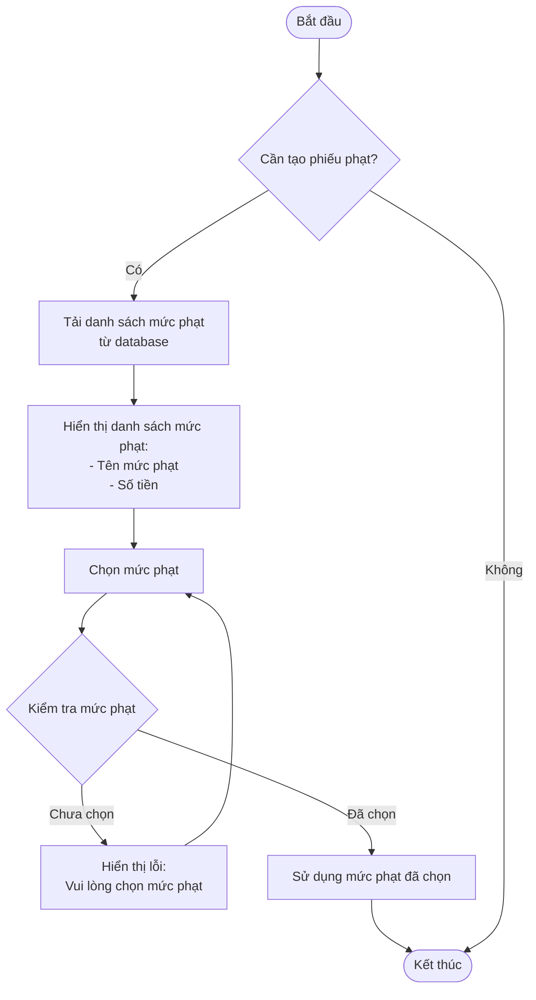
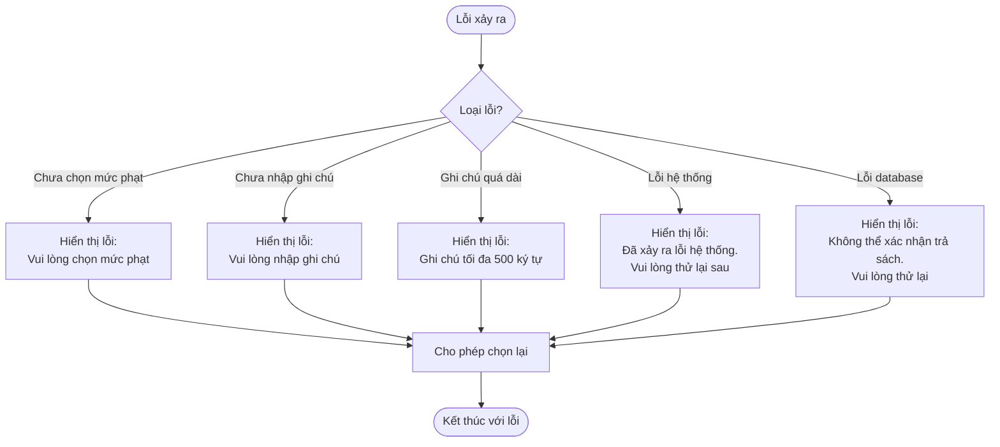

# 2.4.2 Xác Nhận Trả Sách (Confirm Return)

## Thông tin chung
- **Actor:** Nhân viên thư viện
- **Yêu cầu:** Đăng nhập vào hệ thống với vai trò nhân viên thư viện, có yêu cầu trả sách
- **Mô tả:** Cho phép nhân viên thư viện xác nhận trả sách, kiểm tra tình trạng sách và tạo phiếu phạt nếu cần

## Luồng chính



## Luồng xử lý sách bình thường



## Luồng xử lý sách hư hỏng



## Luồng xử lý sách mất



## Luồng chọn mức phạt



## Luồng thay thế

### Luồng 1: Người dùng chưa đăng nhập
- Hệ thống chuyển hướng đến trang đăng nhập

### Luồng 2: Người dùng không phải nhân viên
- Hệ thống chuyển hướng đến dashboard phù hợp với vai trò

### Luồng 3: Không có yêu cầu trả chờ xác nhận
- Hiển thị thông báo "Không có yêu cầu trả nào chờ xác nhận"

### Luồng 4: Chưa chọn mức phạt (khi cần)
- Hiển thị lỗi và yêu cầu chọn mức phạt

### Luồng 5: Chưa nhập ghi chú (khi cần)
- Hiển thị lỗi và yêu cầu nhập ghi chú

## Xử lý lỗi



## Quy tắc validation

| Trường | Quy tắc |
|--------|---------|
| Tình trạng sách | Bắt buộc chọn (Bình thường, Hư hỏng, Mất) |
| Mức phạt | Bắt buộc khi tình trạng là "Hư hỏng", "Mất" hoặc có trả muộn |
| Ghi chú | Bắt buộc khi tình trạng là "Hư hỏng" hoặc "Mất", tối đa 500 ký tự |

## Quy tắc nghiệp vụ

### Xử lý sách bình thường:
1. Kiểm tra có trả muộn không
2. Nếu muộn: Tạo phiếu phạt "Trả muộn"
3. Cập nhật đơn mượn: "Đã trả"
4. Tăng `available_quantity`, giảm `borrowed_quantity`

### Xử lý sách hư hỏng:
1. Bắt buộc chọn mức phạt hư hỏng
2. Bắt buộc nhập ghi chú
3. Kiểm tra có trả muộn không → Tạo phiếu phạt trả muộn nếu có
4. Tạo phiếu phạt hư hỏng
5. Cập nhật đơn mượn: "Đã trả"
6. Tăng `available_quantity`, giảm `borrowed_quantity`

### Xử lý sách mất:
1. Bắt buộc chọn mức phạt mất sách
2. Bắt buộc nhập ghi chú
3. Tạo phiếu phạt mất sách
4. Cập nhật đơn mượn: "Đã trả"
5. Giảm `total_quantity` (sách bị mất)
6. Giảm `borrowed_quantity`

### Kiểm tra trả muộn:
```javascript
if (returnDate > dueDate) {
  // Trả muộn
  createLateFine()
}
```

## Chi tiết kỹ thuật

### Cập nhật số lượng sách (Bình thường/Hư hỏng):
```sql
UPDATE books 
SET available_quantity = available_quantity + 1,
    borrowed_quantity = borrowed_quantity - 1
WHERE id = ?
```

### Cập nhật số lượng sách (Mất):
```sql
UPDATE books 
SET total_quantity = total_quantity - 1,
    borrowed_quantity = borrowed_quantity - 1
WHERE id = ?
```

### Tạo phiếu phạt:
```sql
INSERT INTO fines (
  borrow_id,
  reader_id,
  fine_type,
  fine_level_id,
  amount,
  notes,
  status,
  created_at
) VALUES (?, ?, ?, ?, ?, ?, 'Chưa thanh toán', NOW())
```

### Cập nhật đơn mượn:
```sql
UPDATE borrows 
SET status = 'Đã trả',
    returned_at = NOW(),
    returned_by = ?
WHERE id = ?
```

### Cập nhật yêu cầu trả:
```sql
UPDATE return_requests 
SET status = 'Đã xác nhận',
    confirmed_at = NOW(),
    confirmed_by = ?
WHERE id = ?
```

## Thông tin hiển thị

### Danh sách yêu cầu trả chờ xác nhận:
- Tên độc giả
- Email độc giả
- Tên sách
- Tác giả
- Ngày yêu cầu trả
- Ngày hết hạn (nếu có)
- Nút "Xác nhận trả"

### Form kiểm tra tình trạng sách:
- Radio buttons: Bình thường / Hư hỏng / Mất
- Dropdown chọn mức phạt (khi cần)
- Textarea nhập ghi chú (khi cần)
- Nút "Xác nhận" và "Hủy"

