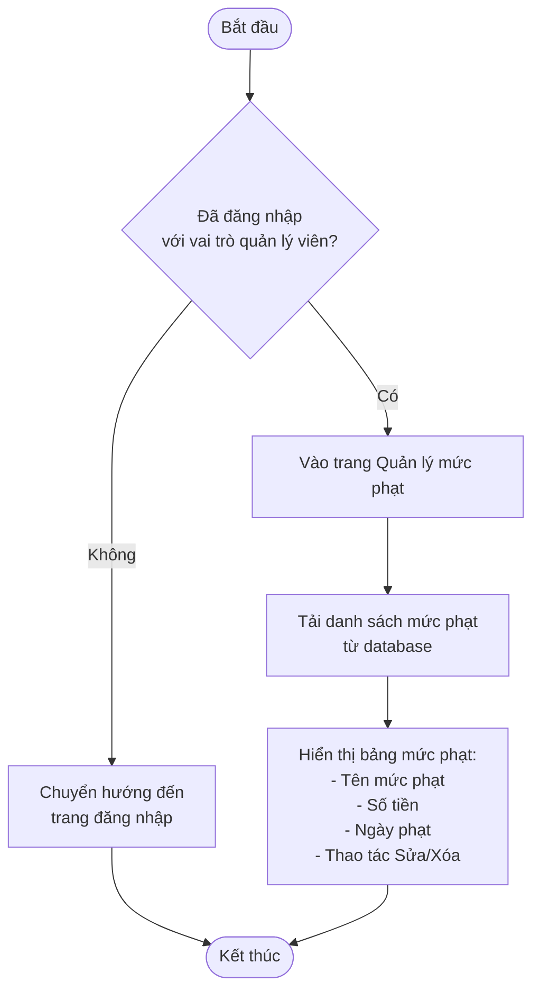
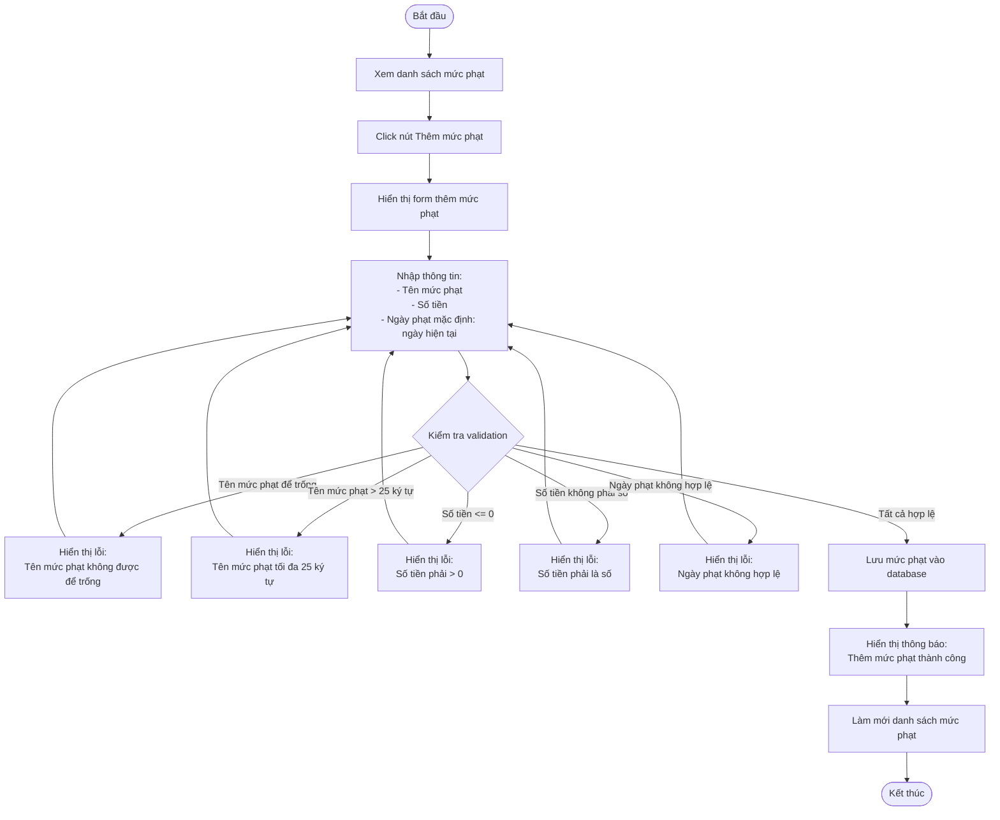
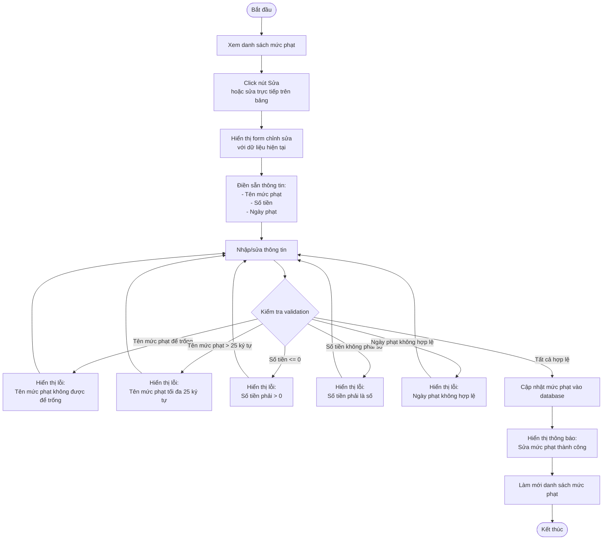
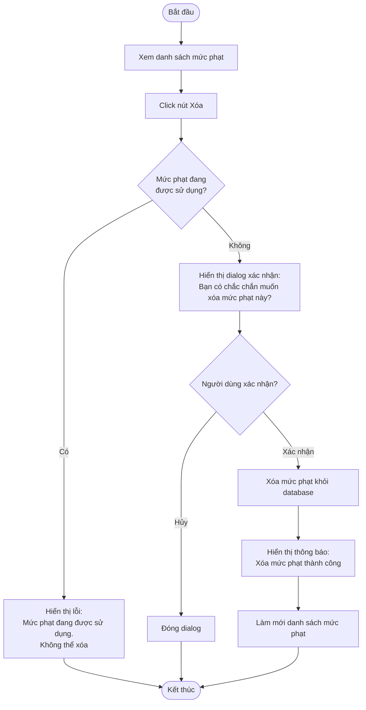
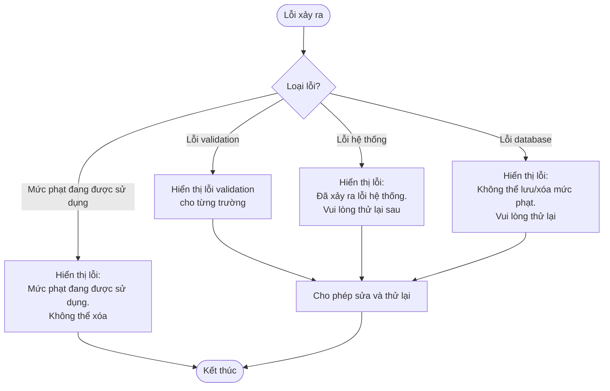

# 2.5.1 Quản lý mức phạt (Fine Level Management)

## Thông tin chung
- **Actor:** Quản lý viên
- **Yêu cầu:** Đăng nhập vào hệ thống với vai trò quản lý viên
- **Mô tả:** Cho phép quản lý viên quản lý các mức phạt (thêm, sửa, xóa)

## Luồng xem danh sách mức phạt



## Luồng thêm mức phạt mới



## Luồng sửa mức phạt



## Luồng xóa mức phạt



## Luồng thay thế

### Luồng 1: Người dùng chưa đăng nhập
- Hệ thống chuyển hướng đến trang đăng nhập

### Luồng 2: Người dùng không phải quản lý viên
- Hệ thống chuyển hướng đến dashboard phù hợp với vai trò

### Luồng 3: Xóa mức phạt đang được sử dụng
- Hệ thống không cho phép xóa và hiển thị lỗi
- Mức phạt đang được sử dụng nếu có phiếu phạt nào đang sử dụng mức phạt này

### Luồng 4: Hủy thao tác
- Người dùng có thể hủy bất kỳ thao tác nào và quay lại danh sách

## Xử lý lỗi



## Quy tắc validation

| Trường | Quy tắc |
|--------|---------|
| Tên mức phạt | Không được để trống, tối đa 25 ký tự |
| Số tiền | Phải > 0, kiểu số |
| Ngày phạt | Ngày hợp lệ, mặc định là ngày hiện tại |

## Quy tắc nghiệp vụ

### Xóa mức phạt:
- Chỉ được xóa khi **không có phiếu phạt nào** đang sử dụng mức phạt này
- Phải có xác nhận từ người dùng trước khi xóa

### Sửa mức phạt:
- Có thể sửa trực tiếp trên bảng (inline editing)
- Hoặc sửa qua form riêng
- Khi sửa, các phiếu phạt đã tạo trước đó vẫn giữ nguyên mức phạt cũ

### Ngày phạt:
- Mặc định là ngày hiện tại
- Có thể chỉnh sửa nếu cần

## Chi tiết kỹ thuật

### Kiểm tra mức phạt đang được sử dụng:
```sql
SELECT COUNT(*) 
FROM fines 
WHERE fine_level_id = ? 
  AND status != 'Đã thanh toán'
```

### Lưu mức phạt:
```sql
INSERT INTO fine_levels (
  name,
  amount,
  fine_date,
  created_at
) VALUES (?, ?, ?, NOW())
```

### Cập nhật mức phạt:
```sql
UPDATE fine_levels 
SET name = ?,
    amount = ?,
    fine_date = ?,
    updated_at = NOW()
WHERE id = ?
```

### Xóa mức phạt:
```sql
DELETE FROM fine_levels 
WHERE id = ? 
  AND NOT EXISTS (
    SELECT 1 FROM fines 
    WHERE fine_level_id = fine_levels.id
  )
```

## Thông tin hiển thị

### Bảng mức phạt:
- ID
- Tên mức phạt
- Số tiền
- Ngày phạt
- Thao tác (Sửa/Xóa)
- Có thể sắp xếp và tìm kiếm
- Hỗ trợ sửa trực tiếp trên bảng

### Form thêm/sửa mức phạt:
- Tên mức phạt (text input)
- Số tiền (number input)
- Ngày phạt (date picker, mặc định: ngày hiện tại)
- Nút "Lưu" và "Hủy"

