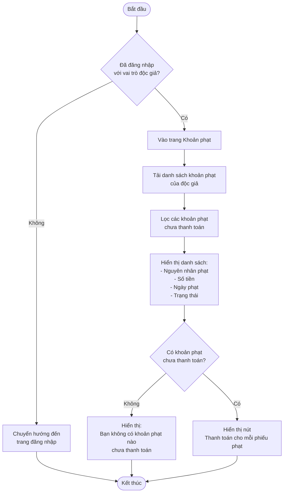
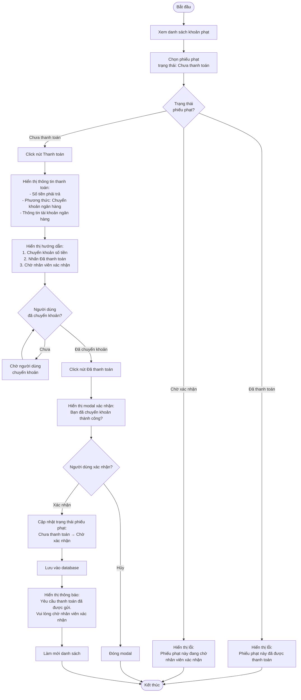
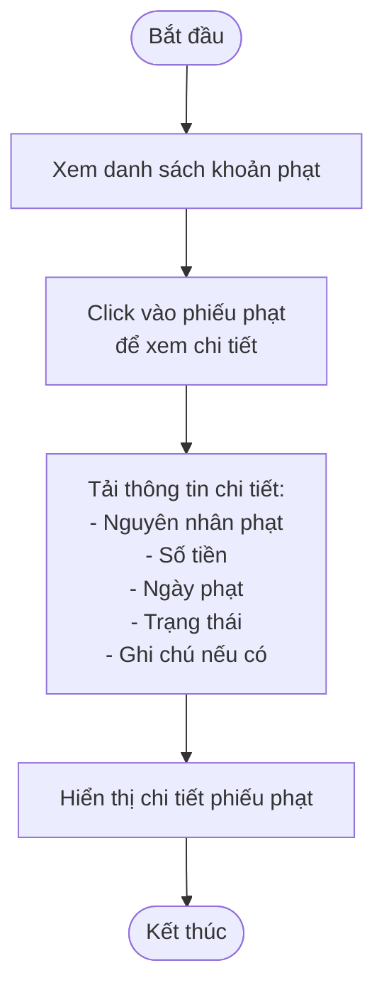
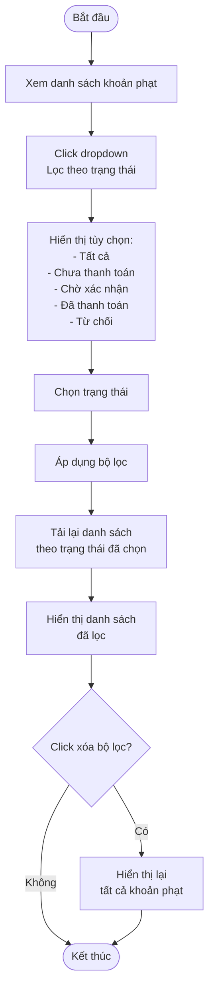
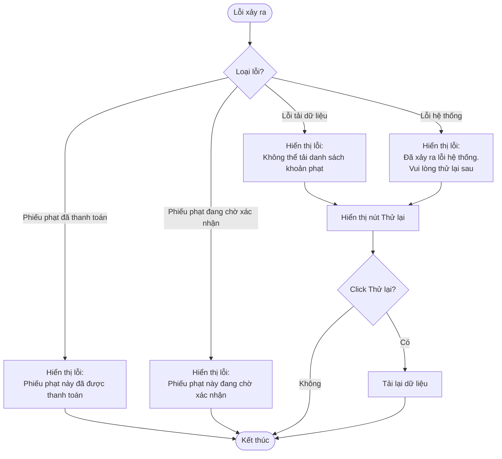

# 2.5.2 Xem & Thanh Toán Khoản Phạt (Độc Giả) - View & Pay Fine (Reader)

## Thông tin chung
- **Actor:** Độc giả
- **Yêu cầu:** Đăng nhập vào hệ thống với vai trò độc giả, có phiếu phạt và mức phạt
- **Mô tả:** Cho phép độc giả xem danh sách khoản phạt và gửi yêu cầu thanh toán

## Luồng xem danh sách khoản phạt



## Luồng thanh toán khoản phạt



## Luồng xem chi tiết phiếu phạt



## Luồng lọc theo trạng thái



## Luồng thay thế

### Luồng 1: Người dùng chưa đăng nhập
- Hệ thống chuyển hướng đến trang đăng nhập

### Luồng 2: Không có khoản phạt
- Hiển thị thông báo "Bạn không có khoản phạt nào"

### Luồng 3: Phiếu phạt đã được thanh toán
- Ẩn hoặc vô hiệu hóa nút "Thanh toán"
- Hiển thị trạng thái "Đã thanh toán"

### Luồng 4: Phiếu phạt đang chờ xác nhận
- Hiển thị trạng thái "Chờ xác nhận"
- Ẩn hoặc vô hiệu hóa nút "Thanh toán"
- Hiển thị thông báo "Đang chờ nhân viên xác nhận"

### Luồng 5: Hủy thao tác
- Người dùng có thể hủy bất kỳ thao tác nào và quay lại danh sách

## Xử lý lỗi



## Quy tắc nghiệp vụ

### Thanh toán khoản phạt:
1. Chỉ có thể thanh toán phiếu phạt ở trạng thái **"Chưa thanh toán"**
2. Sau khi click "Đã thanh toán", trạng thái chuyển thành **"Chờ xác nhận"**
3. Độc giả cần **chuyển khoản qua ngân hàng** trước khi click "Đã thanh toán"
4. Sau khi gửi yêu cầu, phải chờ nhân viên xác nhận (xem 2.5.3)

### Trạng thái phiếu phạt:
- **"Chưa thanh toán"**: Chưa thanh toán, có thể click "Thanh toán"
- **"Chờ xác nhận"**: Đã gửi yêu cầu, chờ nhân viên xác nhận
- **"Đã thanh toán"**: Đã được nhân viên xác nhận
- **"Từ chối"**: Bị nhân viên từ chối (số tiền không phù hợp)

## Chi tiết kỹ thuật

### Cập nhật trạng thái phiếu phạt:
```sql
UPDATE fines 
SET status = 'Chờ xác nhận',
    payment_requested_at = NOW()
WHERE id = ? 
  AND reader_id = ?
  AND status = 'Chưa thanh toán'
```

### Lấy danh sách khoản phạt:
```sql
SELECT 
  f.id,
  f.fine_type,
  f.amount,
  f.fine_date,
  f.status,
  f.notes,
  fl.name as fine_level_name
FROM fines f
LEFT JOIN fine_levels fl ON f.fine_level_id = fl.id
WHERE f.reader_id = ?
ORDER BY f.fine_date DESC
```

## Thông tin hiển thị

### Danh sách khoản phạt:
- Nguyên nhân phạt (Trả muộn, Hư hỏng, Mất sách)
- Số tiền
- Ngày phạt
- Trạng thái
- Nút "Thanh toán" (chỉ hiển thị khi trạng thái = "Chưa thanh toán")
- Nút "Xem chi tiết"

### Thông tin thanh toán:
- Số tiền phải trả
- Phương thức thanh toán: Chuyển khoản ngân hàng
- Thông tin tài khoản ngân hàng (số tài khoản, tên chủ tài khoản, ngân hàng)
- Hướng dẫn thanh toán

### Chi tiết phiếu phạt:
- Nguyên nhân phạt
- Mức phạt
- Số tiền
- Ngày phạt
- Trạng thái
- Ghi chú (nếu có)
- Ngày yêu cầu thanh toán (nếu đã gửi)
- Ngày xác nhận thanh toán (nếu đã xác nhận)

