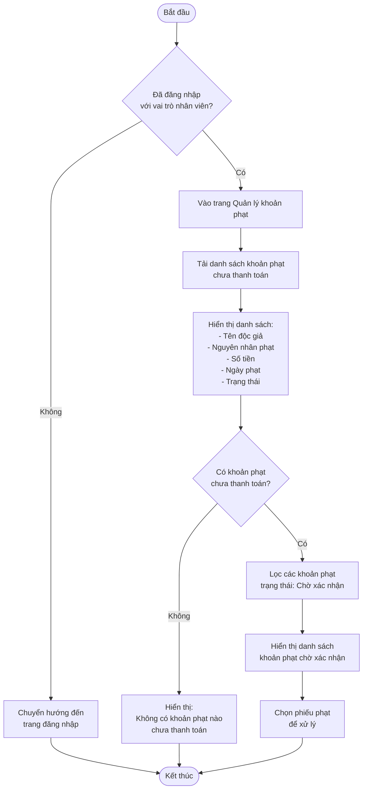
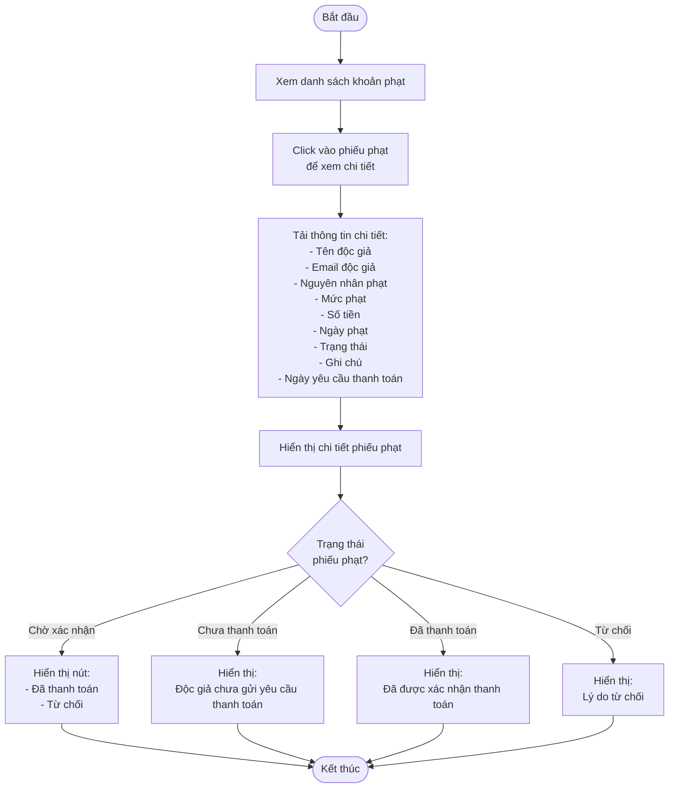
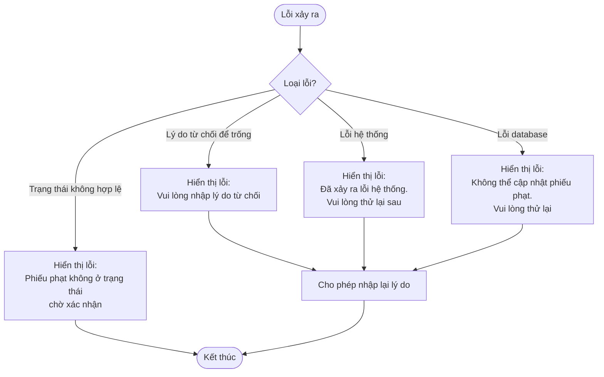

# 2.5.3 Xem & Thanh Toán Khoản Phạt (Nhân Viên Thư Viện) - View & Pay Fine (Librarian)

## Thông tin chung
- **Actor:** Nhân viên thư viện
- **Yêu cầu:** Đăng nhập vào hệ thống với vai trò nhân viên thư viện, có phiếu phạt chờ xác nhận
- **Mô tả:** Cho phép nhân viên thư viện xem và xác nhận/từ chối thanh toán khoản phạt

## Luồng xem danh sách khoản phạt



## Luồng xem chi tiết phiếu phạt



## Luồng xác nhận thanh toán

```mermaid
flowchart TD
    Start([Bắt đầu]) --> ViewDetail[Xem chi tiết phiếu phạt]
    ViewDetail --> CheckStatus{Trạng thái =<br/>Chờ xác nhận?}
    
    CheckStatus -->|Không| ErrorStatus[Hiển thị lỗi:<br/>Phiếu phạt không ở trạng thái<br/>chờ xác nhận]
    CheckStatus -->|Có| ClickConfirm[Click nút Đã thanh toán]
    
    ErrorStatus --> End([Kết thúc])
    
    ClickConfirm --> ShowConfirmModal[Hiển thị modal xác nhận:<br/>Bạn có chắc chắn đã nhận được<br/>thanh toán từ độc giả?]
    ShowConfirmModal --> UserConfirm{Người dùng xác nhận?}
    
    UserConfirm -->|Hủy| Cancel[Đóng modal]
    UserConfirm -->|Xác nhận| UpdateStatus[Cập nhật trạng thái phiếu phạt:<br/>Chờ xác nhận → Đã thanh toán]
    
    Cancel --> End
    
    UpdateStatus --> SetPaidDate[Ghi nhận ngày thanh toán:<br/>paid_at = NOW()]
    SetPaidDate --> SetPaidBy[Ghi nhận người xác nhận:<br/>paid_by = current_user_id]
    SetPaidBy --> SaveDB[Lưu vào database]
    SaveDB --> Success[Hiển thị thông báo:<br/>Xác nhận thanh toán thành công]
    Success --> RefreshList[Làm mới danh sách]
    RefreshList --> End
```

## Luồng từ chối thanh toán

```mermaid
flowchart TD
    Start([Bắt đầu]) --> ViewDetail[Xem chi tiết phiếu phạt]
    ViewDetail --> CheckStatus{Trạng thái =<br/>Chờ xác nhận?}
    
    CheckStatus -->|Không| ErrorStatus[Hiển thị lỗi:<br/>Phiếu phạt không ở trạng thái<br/>chờ xác nhận]
    CheckStatus -->|Có| ClickReject[Click nút Từ chối]
    
    ErrorStatus --> End([Kết thúc])
    
    ClickReject --> ShowRejectForm[Hiển thị form từ chối:<br/>- Lý do từ chối bắt buộc]
    ShowRejectForm --> InputReason[Nhập lý do từ chối:<br/>Ví dụ: Số tiền không phù hợp]
    InputReason --> ValidateReason{Kiểm tra lý do}
    
    ValidateReason -->|Lý do để trống| ErrorEmpty[Hiển thị lỗi:<br/>Vui lòng nhập lý do từ chối]
    ValidateReason -->|Lý do hợp lệ| ShowConfirmModal[Hiển thị modal xác nhận:<br/>Bạn có chắc chắn muốn từ chối<br/>thanh toán này?]
    
    ErrorEmpty --> InputReason
    
    ShowConfirmModal --> UserConfirm{Người dùng xác nhận?}
    
    UserConfirm -->|Hủy| Cancel[Đóng modal]
    UserConfirm -->|Xác nhận| UpdateStatus[Cập nhật trạng thái phiếu phạt:<br/>Chờ xác nhận → Từ chối]
    
    Cancel --> End([Kết thúc])
    
    UpdateStatus --> SaveReason[Lưu lý do từ chối vào database]
    SaveReason --> SetRejectedDate[Ghi nhận ngày từ chối:<br/>rejected_at = NOW()]
    SetRejectedDate --> SetRejectedBy[Ghi nhận người từ chối:<br/>rejected_by = current_user_id]
    SetRejectedBy --> SaveDB[Lưu vào database]
    SaveDB --> Success[Hiển thị thông báo:<br/>Đã từ chối thanh toán]
    Success --> RefreshList[Làm mới danh sách]
    RefreshList --> End
```

## Luồng thay thế

### Luồng 1: Người dùng chưa đăng nhập
- Hệ thống chuyển hướng đến trang đăng nhập

### Luồng 2: Người dùng không phải nhân viên
- Hệ thống chuyển hướng đến dashboard phù hợp với vai trò

### Luồng 3: Không có khoản phạt chờ xác nhận
- Hiển thị thông báo "Không có khoản phạt nào chờ xác nhận"

### Luồng 4: Phiếu phạt không ở trạng thái "Chờ xác nhận"
- Hiển thị lỗi và không cho phép xác nhận/từ chối

### Luồng 5: Hủy thao tác
- Người dùng có thể hủy bất kỳ thao tác nào và quay lại danh sách

## Xử lý lỗi



## Quy tắc validation

| Trường | Quy tắc |
|--------|---------|
| Lý do từ chối | Bắt buộc, không được để trống, tối đa 500 ký tự |

## Quy tắc nghiệp vụ

### Xác nhận thanh toán:
1. Chỉ có thể xác nhận phiếu phạt ở trạng thái **"Chờ xác nhận"**
2. Nhân viên phải **kiểm tra số tiền** đã nhận được từ độc giả
3. Sau khi xác nhận, trạng thái chuyển thành **"Đã thanh toán"**
4. Ghi nhận ngày thanh toán và người xác nhận

### Từ chối thanh toán:
1. Chỉ có thể từ chối phiếu phạt ở trạng thái **"Chờ xác nhận"**
2. Bắt buộc phải nhập **lý do từ chối**
3. Sau khi từ chối, trạng thái chuyển thành **"Từ chối"**
4. Độc giả có thể xem lý do từ chối và thử lại thanh toán

### Kiểm tra số tiền:
- Nhân viên cần kiểm tra số tiền độc giả chuyển khoản có khớp với số tiền phạt không
- Nếu không khớp, nên từ chối và yêu cầu độc giả thanh toán lại

## Chi tiết kỹ thuật

### Cập nhật trạng thái khi xác nhận:
```sql
UPDATE fines 
SET status = 'Đã thanh toán',
    paid_at = NOW(),
    paid_by = ?
WHERE id = ? 
  AND status = 'Chờ xác nhận'
```

### Cập nhật trạng thái khi từ chối:
```sql
UPDATE fines 
SET status = 'Từ chối',
    rejection_reason = ?,
    rejected_at = NOW(),
    rejected_by = ?
WHERE id = ? 
  AND status = 'Chờ xác nhận'
```

### Lấy danh sách khoản phạt chờ xác nhận:
```sql
SELECT 
  f.id,
  u.name as reader_name,
  u.email as reader_email,
  f.fine_type,
  f.amount,
  f.fine_date,
  f.status,
  f.payment_requested_at,
  f.notes
FROM fines f
JOIN users u ON f.reader_id = u.id
WHERE f.status = 'Chờ xác nhận'
ORDER BY f.payment_requested_at ASC
```

## Thông tin hiển thị

### Danh sách khoản phạt chờ xác nhận:
- Tên độc giả
- Email độc giả
- Nguyên nhân phạt
- Số tiền
- Ngày phạt
- Ngày yêu cầu thanh toán
- Nút "Xem chi tiết"

### Chi tiết phiếu phạt:
- Tên độc giả
- Email độc giả
- Số điện thoại độc giả
- Nguyên nhân phạt
- Mức phạt
- Số tiền
- Ngày phạt
- Trạng thái
- Ghi chú (nếu có)
- Ngày yêu cầu thanh toán
- Nút "Đã thanh toán" và "Từ chối" (nếu trạng thái = "Chờ xác nhận")

### Form từ chối:
- Textarea nhập lý do từ chối (bắt buộc)
- Nút "Xác nhận" và "Hủy"

