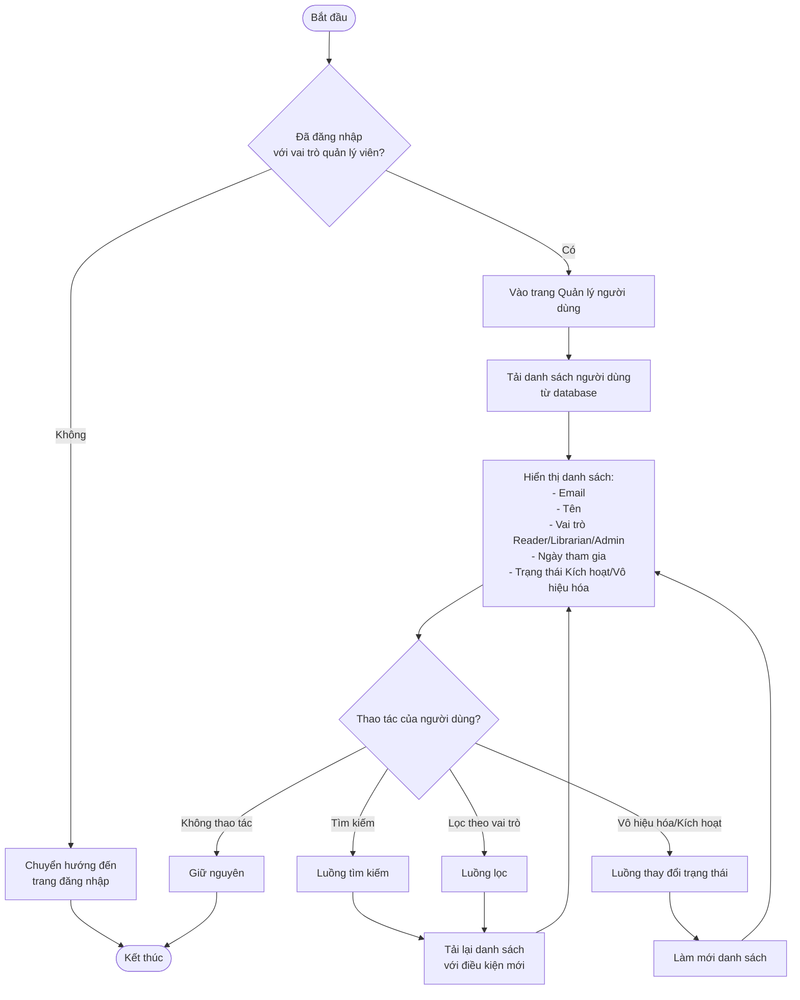
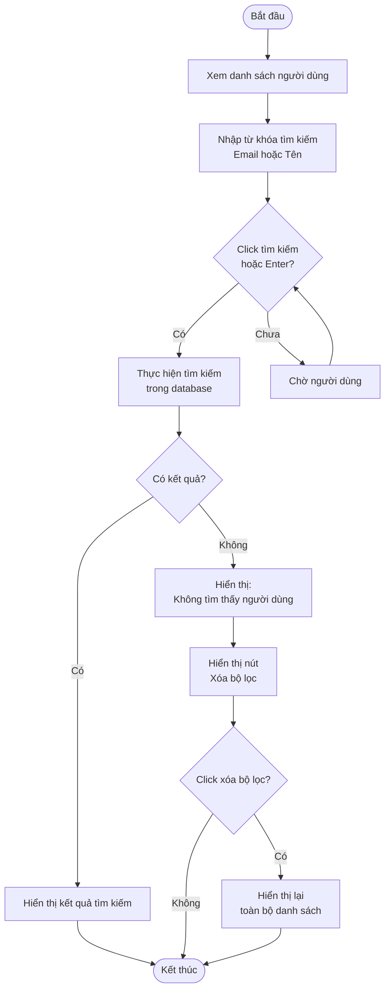
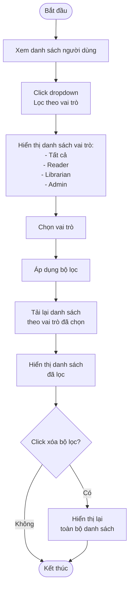
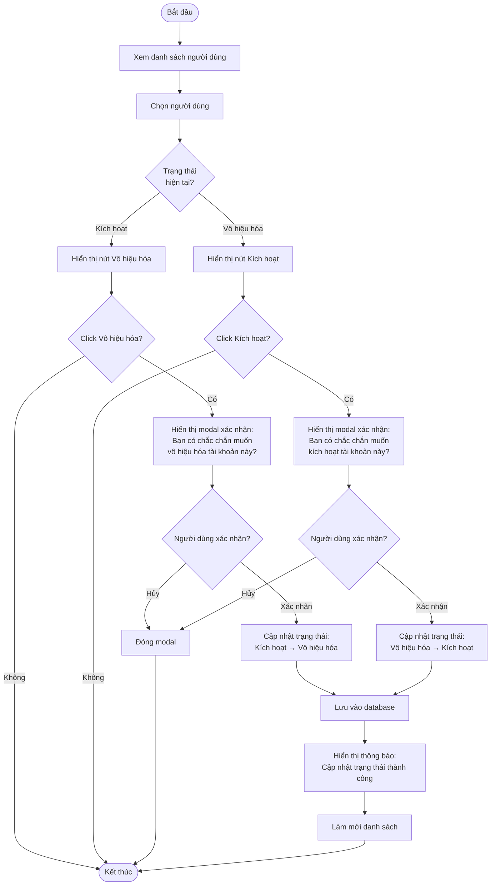
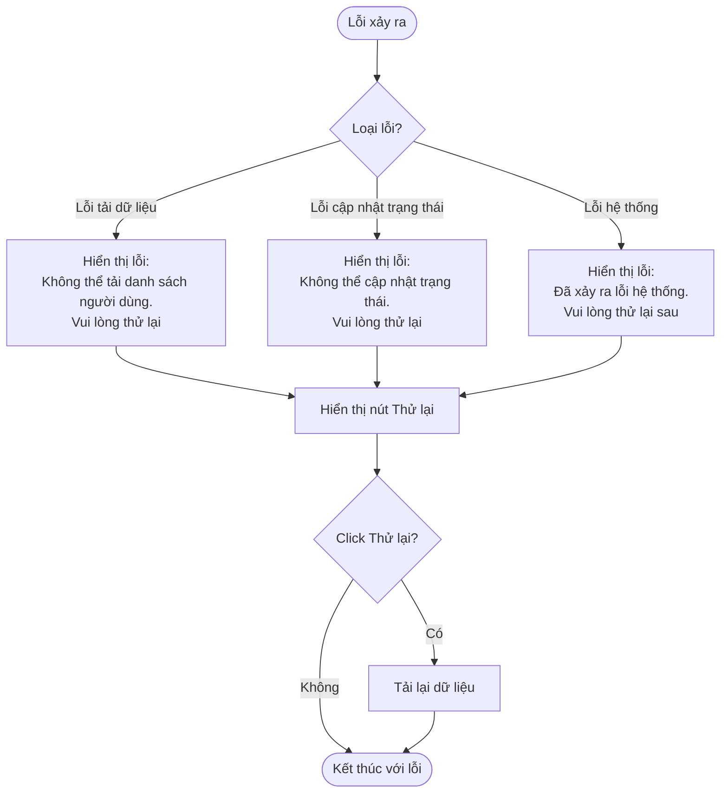

# 2.6.1 Danh Sách Người Dùng (User List)

## Thông tin chung
- **Actor:** Quản lý viên
- **Yêu cầu:** Đăng nhập vào hệ thống với vai trò quản lý viên
- **Mô tả:** Cho phép quản lý viên xem danh sách người dùng, tìm kiếm, lọc và quản lý trạng thái tài khoản

## Luồng chính



## Luồng tìm kiếm



## Luồng lọc theo vai trò



## Luồng vô hiệu hóa/Kích hoạt tài khoản



## Luồng thay thế

### Luồng 1: Người dùng chưa đăng nhập
- Hệ thống chuyển hướng đến trang đăng nhập

### Luồng 2: Người dùng không phải quản lý viên
- Hệ thống chuyển hướng đến dashboard phù hợp với vai trò

### Luồng 3: Không có người dùng nào
- Hiển thị thông báo "Chưa có người dùng nào trong hệ thống"

### Luồng 4: Tìm kiếm không có kết quả
- Hiển thị thông báo "Không tìm thấy người dùng phù hợp"
- Cung cấp nút để xóa bộ lọc và xem lại toàn bộ danh sách

### Luồng 5: Lọc không có kết quả
- Hiển thị thông báo "Không có người dùng nào thuộc vai trò này"

### Luồng 6: Vô hiệu hóa tài khoản của chính mình
- Có thể cảnh báo hoặc không cho phép vô hiệu hóa tài khoản của chính mình

## Xử lý lỗi



## Quy tắc nghiệp vụ

### Vô hiệu hóa tài khoản:
- Tài khoản bị vô hiệu hóa không thể đăng nhập
- Các đơn mượn và phiếu phạt hiện tại vẫn được giữ nguyên
- Quản lý viên có thể kích hoạt lại tài khoản bất cứ lúc nào

### Kích hoạt tài khoản:
- Tài khoản được kích hoạt lại có thể đăng nhập bình thường
- Tất cả quyền và dữ liệu liên quan được khôi phục

### Tìm kiếm:
- Tìm kiếm theo **Email** hoặc **Tên**
- Tìm kiếm không phân biệt hoa thường
- Tìm kiếm một phần (partial match)

### Lọc:
- Lọc theo **Vai trò**: Reader, Librarian, Admin
- Có thể kết hợp với tìm kiếm

## Chi tiết kỹ thuật

### Lấy danh sách người dùng:
```sql
SELECT 
  id,
  email,
  name,
  role,
  created_at,
  status
FROM users
WHERE deleted_at IS NULL
ORDER BY created_at DESC
```

### Tìm kiếm người dùng:
```sql
SELECT * 
FROM users
WHERE (email ILIKE ? OR name ILIKE ?)
  AND deleted_at IS NULL
ORDER BY created_at DESC
```

### Lọc theo vai trò:
```sql
SELECT * 
FROM users
WHERE role = ?
  AND deleted_at IS NULL
ORDER BY created_at DESC
```

### Cập nhật trạng thái:
```sql
UPDATE users 
SET status = ?,
    updated_at = NOW()
WHERE id = ?
```

## Thông tin hiển thị

### Bảng danh sách người dùng:
- Email
- Tên
- Vai trò (Reader/Librarian/Admin)
- Ngày tham gia
- Trạng thái (Kích hoạt/Vô hiệu hóa)
- Thao tác (Vô hiệu hóa/Kích hoạt)

### Tìm kiếm:
- Ô tìm kiếm với placeholder: "Tìm kiếm theo email hoặc tên"
- Nút tìm kiếm hoặc tự động tìm khi nhập

### Lọc:
- Dropdown lọc theo vai trò
- Có tùy chọn "Tất cả" để xem tất cả vai trò

### Phân trang:
- Hiển thị số lượng người dùng trên mỗi trang (ví dụ: 20 người dùng/trang)
- Có nút chuyển trang và chọn trang cụ thể

