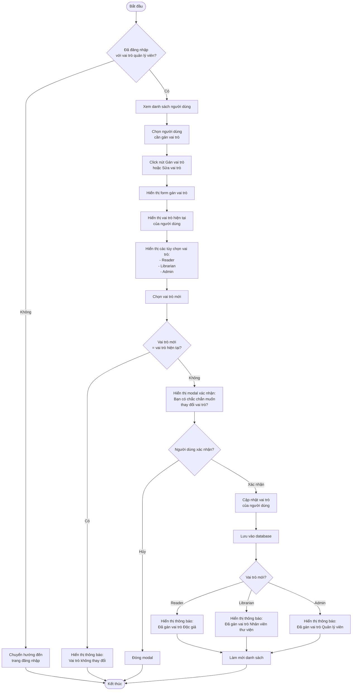
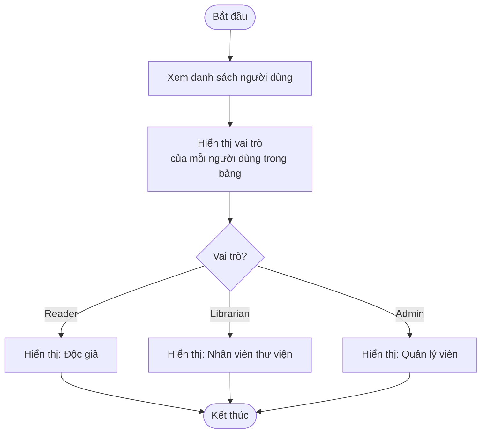
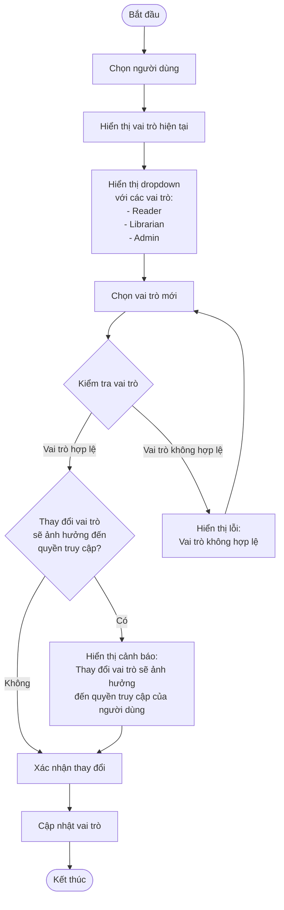
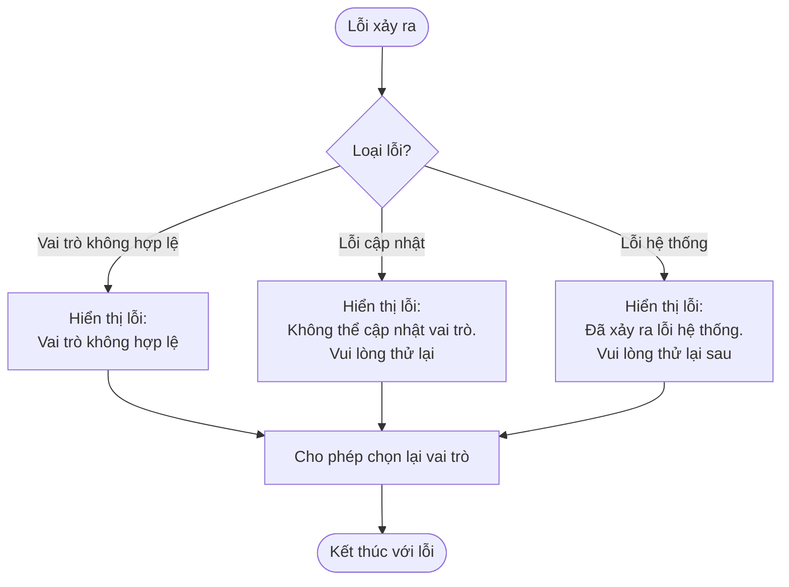

# 2.6.2 Gán Vai Trò (Assign Role)

## Thông tin chung
- **Actor:** Quản lý viên
- **Yêu cầu:** Đăng nhập vào hệ thống với vai trò quản lý viên, đã có danh sách người dùng
- **Mô tả:** Cho phép quản lý viên gán vai trò cho người dùng (Reader, Librarian, Admin)

## Luồng chính



## Luồng xem vai trò hiện tại



## Luồng thay đổi vai trò chi tiết



## Luồng thay thế

### Luồng 1: Người dùng chưa đăng nhập
- Hệ thống chuyển hướng đến trang đăng nhập

### Luồng 2: Người dùng không phải quản lý viên
- Hệ thống chuyển hướng đến dashboard phù hợp với vai trò

### Luồng 3: Vai trò không thay đổi
- Hiển thị thông báo và không thực hiện cập nhật

### Luồng 4: Gán vai trò cho chính mình
- Có thể cảnh báo hoặc không cho phép gán vai trò cho chính mình
- Đặc biệt là không cho phép tự hạ cấp vai trò Admin

### Luồng 5: Hủy thao tác
- Người dùng có thể hủy bất kỳ thao tác nào và quay lại danh sách

## Xử lý lỗi



## Quy tắc nghiệp vụ

### Các vai trò trong hệ thống:

#### Reader (Độc giả):
- Chỉ có thể mượn sách
- Xem lịch sử cá nhân
- Thanh toán phạt
- Cập nhật hồ sơ cá nhân

#### Librarian (Nhân viên thư viện):
- Quản lý sách (thêm, sửa, xóa)
- Xác nhận mượn/trả sách
- Theo dõi phạt
- Xem báo cáo tổng quan

#### Admin (Quản lý viên):
- Toàn quyền
- Quản lý tài khoản người dùng
- Gán vai trò
- Xem báo cáo thống kê
- Cài đặt hệ thống
- Quản lý mức phạt

### Thay đổi vai trò:
- Khi thay đổi vai trò, người dùng sẽ mất quyền của vai trò cũ và nhận quyền của vai trò mới
- Các dữ liệu liên quan (đơn mượn, phiếu phạt) vẫn được giữ nguyên
- Người dùng cần đăng xuất và đăng nhập lại để áp dụng quyền mới

### Bảo vệ quản lý viên:
- Không cho phép tự hạ cấp vai trò của chính mình từ Admin xuống Reader/Librarian
- Có thể cảnh báo khi thay đổi vai trò của chính mình

## Chi tiết kỹ thuật

### Cập nhật vai trò:
```sql
UPDATE users 
SET role = ?,
    updated_at = NOW()
WHERE id = ?
```

### Kiểm tra vai trò hiện tại:
```sql
SELECT role 
FROM users 
WHERE id = ?
```

### Lấy danh sách vai trò:
```javascript
const roles = [
  { value: 'Reader', label: 'Độc giả' },
  { value: 'Librarian', label: 'Nhân viên thư viện' },
  { value: 'Admin', label: 'Quản lý viên' }
]
```

## Thông tin hiển thị

### Form gán vai trò:
- Tên người dùng
- Email người dùng
- Vai trò hiện tại (chỉ đọc)
- Dropdown chọn vai trò mới:
  - Reader (Độc giả)
  - Librarian (Nhân viên thư viện)
  - Admin (Quản lý viên)
- Mô tả quyền của từng vai trò (tùy chọn)
- Nút "Lưu" và "Hủy"

### Modal xác nhận:
- Tiêu đề: "Xác nhận thay đổi vai trò"
- Nội dung:
  - Tên người dùng
  - Vai trò hiện tại → Vai trò mới
  - Cảnh báo về ảnh hưởng đến quyền truy cập
- Nút: "Xác nhận" và "Hủy"

### Trong bảng danh sách người dùng:
- Hiển thị vai trò hiện tại
- Nút "Gán vai trò" hoặc "Sửa vai trò" cho mỗi người dùng

