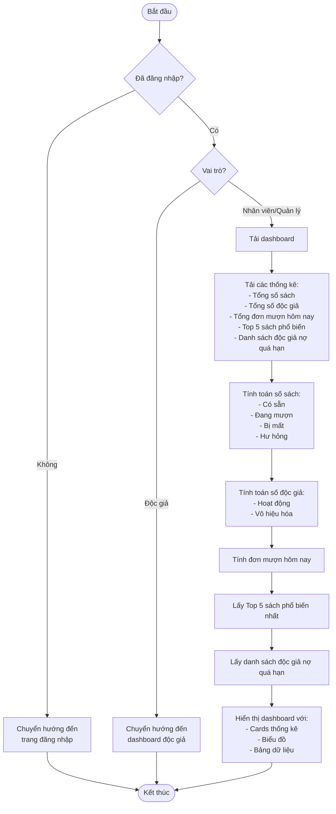
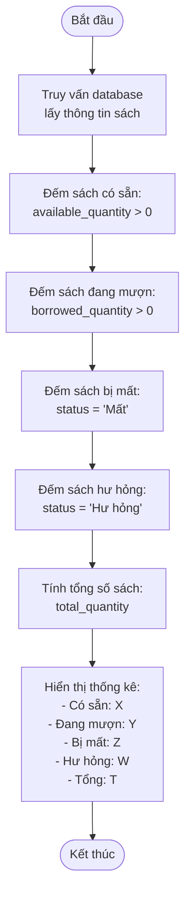
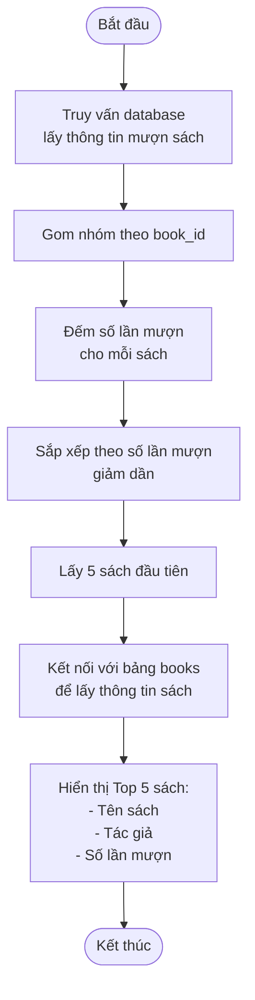
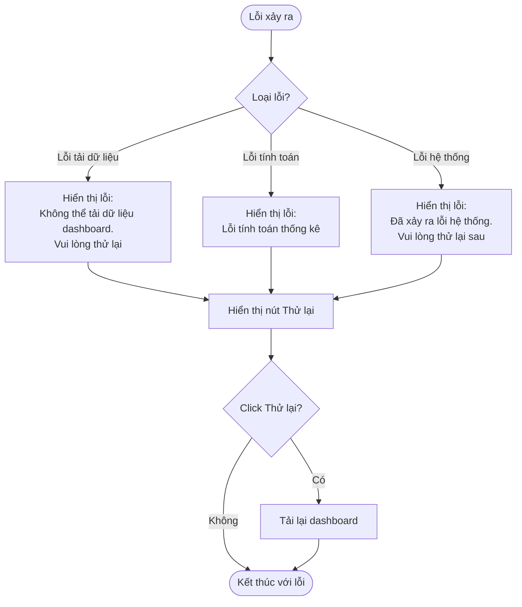

# 2.7.1 Báo Cáo Tổng Quan (Dashboard Overview)

## Thông tin chung
- **Actor:** Quản lý viên, Nhân viên thư viện
- **Yêu cầu:** Đăng nhập vào hệ thống với vai trò quản lý viên hoặc nhân viên thư viện, có dữ liệu sách, mượn, trả
- **Mô tả:** Hiển thị tổng quan các thống kê quan trọng của hệ thống

## Luồng chính



## Luồng tính toán thống kê sách



## Luồng tính toán thống kê độc giả

```mermaid
flowchart TD
    Start([Bắt đầu]) --> QueryReaders[Truy vấn database<br/>lấy thông tin độc giả]
    QueryReaders --> FilterActive[Lọc độc giả hoạt động:<br/>status = 'Kích hoạt'<br/>AND role = 'Reader']
    FilterActive --> CountActive[Đếm số lượng:<br/>COUNT(*)]
    CountActive --> FilterDisabled[Lọc độc giả vô hiệu hóa:<br/>status = 'Vô hiệu hóa'<br/>AND role = 'Reader']
    FilterDisabled --> CountDisabled[Đếm số lượng:<br/>COUNT(*)]
    CountDisabled --> DisplayStats[Hiển thị thống kê:<br/>- Hoạt động: X<br/>- Vô hiệu hóa: Y<br/>- Tổng: X + Y]
    DisplayStats --> End([Kết thúc])
```

## Luồng lấy Top 5 sách phổ biến



## Luồng lấy danh sách độc giả nợ quá hạn

```mermaid
flowchart TD
    Start([Bắt đầu]) --> QueryOverdue[Truy vấn database<br/>lấy đơn mượn quá hạn]
    QueryOverdue --> FilterOverdue[Lọc đơn mượn:<br/>status = 'Quá hạn'<br/>AND due_date < NOW()]
    FilterOverdue --> GroupByReader[Gom nhóm theo reader_id]
    GroupByReader --> CountOverdue[Đếm số sách quá hạn<br/>cho mỗi độc giả]
    CountOverdue --> JoinReaderInfo[Kết nối với bảng users<br/>để lấy thông tin độc giả]
    JoinReaderInfo --> SortByCount[Sắp xếp theo số sách quá hạn<br/>giảm dần]
    SortByCount --> DisplayList[Hiển thị danh sách:<br/>- Tên độc giả<br/>- Email<br/>- Số sách quá hạn]
    DisplayList --> End([Kết thúc])
```

## Luồng thay thế

### Luồng 1: Người dùng chưa đăng nhập
- Hệ thống chuyển hướng đến trang đăng nhập

### Luồng 2: Người dùng là độc giả
- Hệ thống chuyển hướng đến dashboard độc giả (không có tính năng này)

### Luồng 3: Chưa có dữ liệu
- Hiển thị 0 cho tất cả các thống kê
- Hiển thị thông báo "Chưa có dữ liệu" cho các phần không có dữ liệu

### Luồng 4: Lỗi tải dữ liệu
- Hiển thị thông báo lỗi và nút "Thử lại"
- Cho phép người dùng tải lại dashboard

## Xử lý lỗi



## Thông tin hiển thị

### Cards thống kê:

#### Tổng số sách:
- Có sẵn: X
- Đang mượn: Y
- Bị mất: Z
- Hư hỏng: W
- Tổng: T

#### Tổng số độc giả:
- Hoạt động: X
- Vô hiệu hóa: Y
- Tổng: X + Y

#### Tổng đơn mượn hôm nay:
- Số đơn mượn được tạo hôm nay

### Top 5 sách phổ biến nhất:
- Bảng hoặc danh sách hiển thị:
  - Tên sách
  - Tác giả
  - Số lần mượn
  - Có thể sắp xếp theo số lần mượn

### Danh sách độc giả nợ quá hạn:
- Bảng hiển thị:
  - Tên độc giả
  - Email
  - Số sách quá hạn
  - Có thể click để xem chi tiết

## Chi tiết kỹ thuật

### Tính toán số sách:
```sql
SELECT 
  SUM(available_quantity) as available,
  SUM(borrowed_quantity) as borrowed,
  COUNT(CASE WHEN status = 'Mất' THEN 1 END) as lost,
  COUNT(CASE WHEN status = 'Hư hỏng' THEN 1 END) as damaged,
  SUM(total_quantity) as total
FROM books
```

### Tính toán số độc giả:
```sql
SELECT 
  COUNT(CASE WHEN status = 'Kích hoạt' THEN 1 END) as active,
  COUNT(CASE WHEN status = 'Vô hiệu hóa' THEN 1 END) as disabled,
  COUNT(*) as total
FROM users
WHERE role = 'Reader'
```

### Đếm đơn mượn hôm nay:
```sql
SELECT COUNT(*) 
FROM borrows
WHERE DATE(created_at) = CURRENT_DATE
```

### Top 5 sách phổ biến:
```sql
SELECT 
  b.id,
  b.title,
  b.author,
  COUNT(br.id) as borrow_count
FROM books b
JOIN borrows br ON b.id = br.book_id
GROUP BY b.id, b.title, b.author
ORDER BY borrow_count DESC
LIMIT 5
```

### Độc giả nợ quá hạn:
```sql
SELECT 
  u.id,
  u.name,
  u.email,
  COUNT(br.id) as overdue_count
FROM users u
JOIN borrows br ON u.id = br.reader_id
WHERE br.status = 'Quá hạn'
  AND br.due_date < NOW()
GROUP BY u.id, u.name, u.email
ORDER BY overdue_count DESC
```

