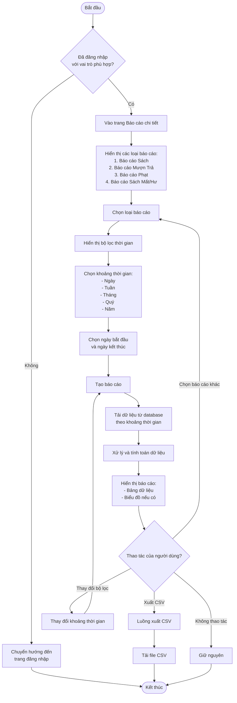
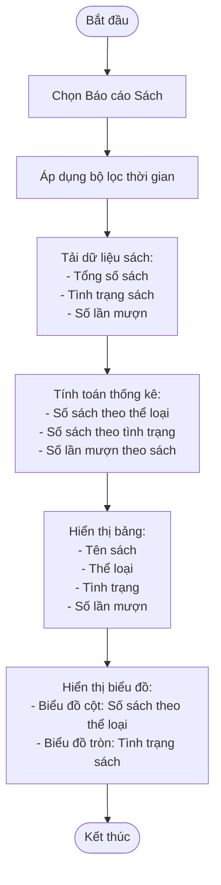
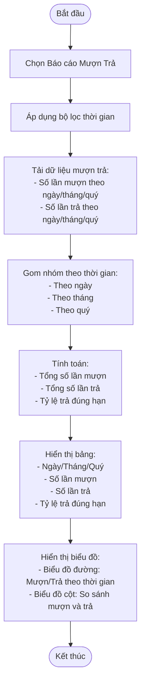
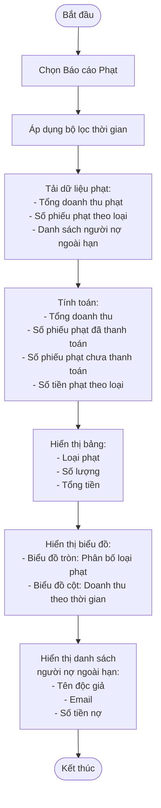
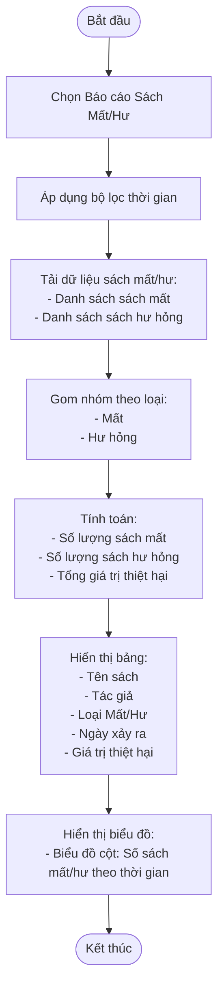
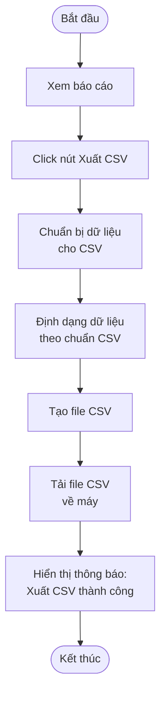
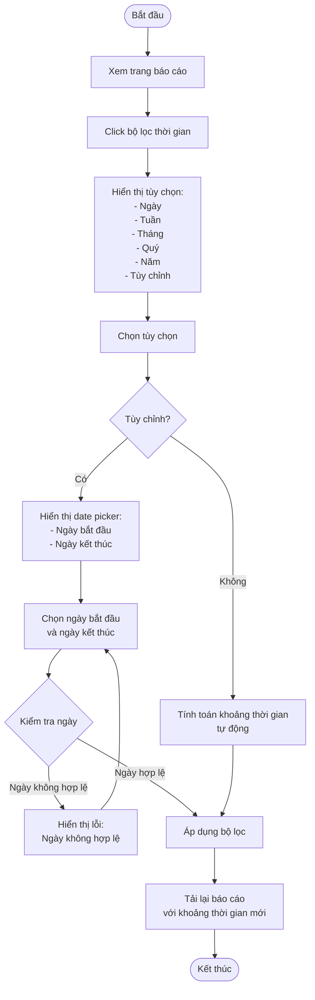
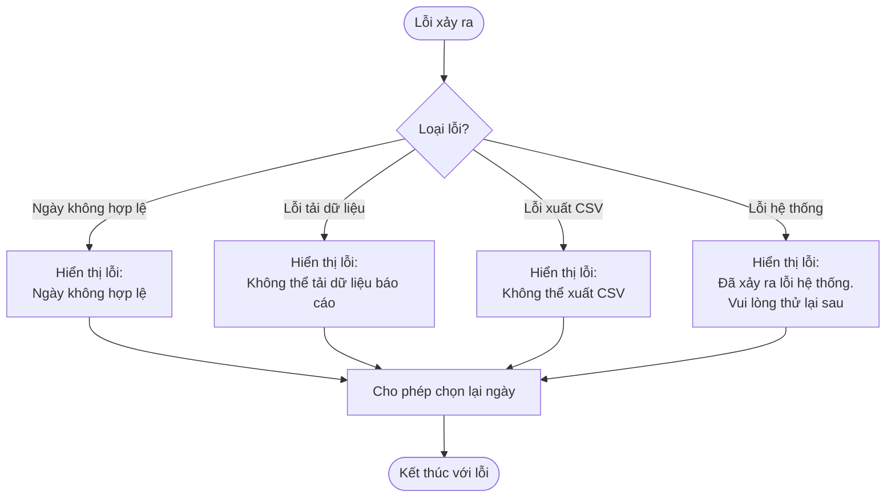

# 2.7.2 Báo Cáo Chi Tiết (Detailed Reports)

## Thông tin chung
- **Actor:** Quản lý viên, Nhân viên thư viện
- **Yêu cầu:** Đăng nhập vào hệ thống với vai trò quản lý viên hoặc nhân viên thư viện, có dashboard và dữ liệu đầy đủ
- **Mô tả:** Cho phép xem các báo cáo chi tiết với khả năng lọc theo thời gian và xuất CSV

## Luồng chính



## Luồng báo cáo Sách



## Luồng báo cáo Mượn Trả



## Luồng báo cáo Phạt



## Luồng báo cáo Sách Mất/Hư



## Luồng xuất CSV



## Luồng lọc theo khoảng thời gian



## Luồng thay thế

### Luồng 1: Người dùng chưa đăng nhập
- Hệ thống chuyển hướng đến trang đăng nhập

### Luồng 2: Người dùng không phải nhân viên/quản lý
- Hệ thống chuyển hướng đến dashboard phù hợp với vai trò

### Luồng 3: Không có dữ liệu trong khoảng thời gian
- Hiển thị thông báo "Không có dữ liệu trong khoảng thời gian này"
- Hiển thị bảng trống hoặc biểu đồ rỗng

### Luồng 4: Lỗi xuất CSV
- Hiển thị lỗi và cho phép thử lại

## Xử lý lỗi



## Quy tắc nghiệp vụ

### Các báo cáo có sẵn:

#### 1. Báo cáo Sách:
- Tổng số sách
- Tình trạng sách (Có sẵn, Đang mượn, Mất, Hư hỏng)
- Số lần mượn theo sách
- Phân bố sách theo thể loại

#### 2. Báo cáo Mượn Trả:
- Số lần mượn theo ngày/tháng/quý
- Số lần trả theo ngày/tháng/quý
- Tỷ lệ trả đúng hạn
- So sánh mượn và trả

#### 3. Báo cáo Phạt:
- Tổng doanh thu phạt
- Số phiếu phạt theo loại (Trả muộn, Hư hỏng, Mất)
- Số phiếu phạt đã thanh toán/chưa thanh toán
- Danh sách người nợ ngoài hạn

#### 4. Báo cáo Sách Mất/Hư:
- Danh sách sách cần thay thế
- Số lượng sách mất/hư hỏng
- Tổng giá trị thiệt hại

### Lọc theo khoảng thời gian:
- **Ngày**: Dữ liệu trong 1 ngày cụ thể
- **Tuần**: Dữ liệu trong 1 tuần (7 ngày)
- **Tháng**: Dữ liệu trong 1 tháng
- **Quý**: Dữ liệu trong 1 quý (3 tháng)
- **Năm**: Dữ liệu trong 1 năm
- **Tùy chỉnh**: Chọn ngày bắt đầu và ngày kết thúc

### Xuất CSV:
- Xuất tất cả dữ liệu hiển thị trong báo cáo
- File CSV có tên: `[Tên báo cáo]_[Ngày xuất].csv`
- Encoding: UTF-8 với BOM để hiển thị tiếng Việt đúng

## Chi tiết kỹ thuật

### Lấy dữ liệu báo cáo sách:
```sql
SELECT 
  b.title,
  c.name as category,
  b.status,
  COUNT(br.id) as borrow_count
FROM books b
LEFT JOIN categories c ON b.category_id = c.id
LEFT JOIN borrows br ON b.id = br.book_id
WHERE br.created_at BETWEEN ? AND ?
GROUP BY b.id, b.title, c.name, b.status
```

### Lấy dữ liệu báo cáo mượn trả:
```sql
SELECT 
  DATE(created_at) as date,
  COUNT(*) as borrow_count
FROM borrows
WHERE created_at BETWEEN ? AND ?
GROUP BY DATE(created_at)
ORDER BY date
```

### Lấy dữ liệu báo cáo phạt:
```sql
SELECT 
  fine_type,
  COUNT(*) as count,
  SUM(amount) as total_amount
FROM fines
WHERE created_at BETWEEN ? AND ?
GROUP BY fine_type
```

### Format CSV:
```javascript
const csvContent = [
  ['Header1', 'Header2', 'Header3'],
  ['Data1', 'Data2', 'Data3'],
  // ...
].map(row => row.join(',')).join('\n')
```

## Thông tin hiển thị

### Trang báo cáo:
- Dropdown chọn loại báo cáo
- Bộ lọc thời gian (dropdown + date picker)
- Bảng dữ liệu
- Biểu đồ (nếu có)
- Nút "Xuất CSV"

### Bảng dữ liệu:
- Có thể sắp xếp theo các cột
- Có thể tìm kiếm trong bảng
- Phân trang nếu dữ liệu nhiều

### Biểu đồ:
- Sử dụng thư viện Recharts
- Responsive, tự động điều chỉnh kích thước
- Có tooltip khi hover
- Có legend để phân biệt các series

