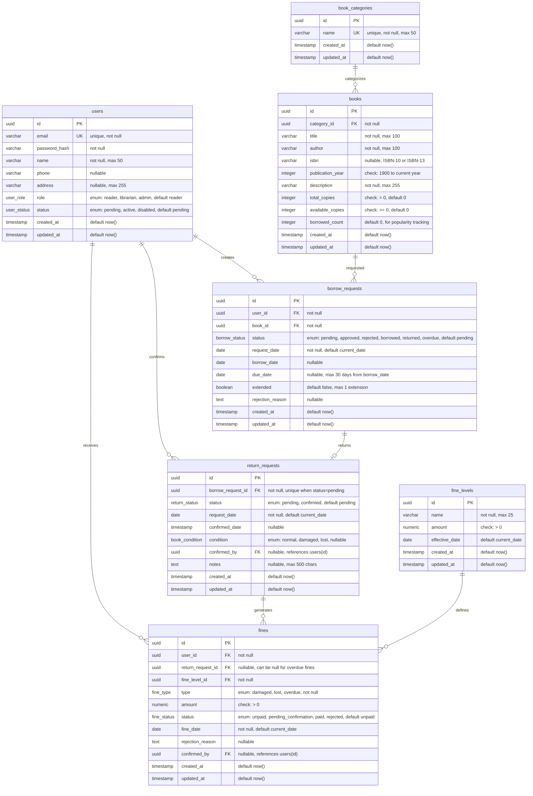

# Database Schema - Library Management System

## Entity-Relationship Diagram



## Table Relationships

### One-to-Many Relationships
- `users` → `borrow_requests`: One user can have many borrow requests
- `users` → `fines`: One user can have many fines
- `book_categories` → `books`: One category can have many books
- `books` → `borrow_requests`: One book can be requested many times
- `borrow_requests` → `return_requests`: One borrow request can have one return request
- `return_requests` → `fines`: One return request can generate multiple fines (damaged + overdue)
- `fine_levels` → `fines`: One fine level can be used in many fines

### Many-to-One Relationships
- `return_requests.confirmed_by` → `users`: Many return requests can be confirmed by one user (librarian/admin)
- `fines.confirmed_by` → `users`: Many fines can be confirmed by one user (librarian/admin)

**Note**: The ERD shows the primary relationships. Additional relationships:
- Users can confirm return requests (via `return_requests.confirmed_by` FK)
- Users can confirm fine payments (via `fines.confirmed_by` FK)

## Key Constraints

### Primary Keys (PK)
- All tables use `uuid` type with `gen_random_uuid()` as default
- Primary keys: `id` in all tables

### Foreign Keys (FK)
- `books.category_id` → `book_categories.id`
- `borrow_requests.user_id` → `users.id`
- `borrow_requests.book_id` → `books.id`
- `return_requests.borrow_request_id` → `borrow_requests.id`
- `return_requests.confirmed_by` → `users.id`
- `fines.user_id` → `users.id`
- `fines.return_request_id` → `return_requests.id`
- `fines.fine_level_id` → `fine_levels.id`
- `fines.confirmed_by` → `users.id`

### Unique Constraints
- `users.email`: Must be unique
- `book_categories.name`: Must be unique
- `return_requests.borrow_request_id`: Unique when status is 'pending' (one pending return per borrow)

### Check Constraints
- `books.publication_year`: Between 1900 and current year
- `books.total_copies`: Must be > 0
- `books.available_copies`: Must be >= 0
- `fines.amount`: Must be > 0
- `fine_levels.amount`: Must be > 0

## Indexes

### Performance Indexes
1. **Foreign Key Indexes** (B-tree)
   - `idx_books_category_id` on `books(category_id)`
   - `idx_borrow_requests_user_id` on `borrow_requests(user_id)`
   - `idx_borrow_requests_book_id` on `borrow_requests(book_id)`
   - `idx_borrow_requests_status` on `borrow_requests(status)`
   - `idx_return_requests_borrow_request_id` on `return_requests(borrow_request_id)`
   - `idx_return_requests_status` on `return_requests(status)`
   - `idx_fines_user_id` on `fines(user_id)`
   - `idx_fines_status` on `fines(status)`
   - `idx_fines_return_request_id` on `fines(return_request_id)`

2. **Composite Indexes** (for common query patterns)
   - `idx_borrow_requests_user_status` on `borrow_requests(user_id, status)` - for user's borrowing history
   - `idx_borrow_requests_book_status` on `borrow_requests(book_id, status)` - for book availability checks
   - `idx_borrow_requests_due_date` on `borrow_requests(due_date)` where `status = 'borrowed'` - for overdue detection
   - `idx_fines_user_status` on `fines(user_id, status)` - for user's unpaid fines
   - `idx_books_category_available` on `books(category_id, available_copies)` - for book listing with filters

3. **Unique Indexes**
   - `idx_users_email_unique` on `users(email)` - for login lookups
   - `idx_book_categories_name_unique` on `book_categories(name)` - for category validation

4. **Full-Text Search Indexes** (for search functionality)
   - `idx_books_title_gin` on `books` using `gin(to_tsvector('english', title))`
   - `idx_books_author_gin` on `books` using `gin(to_tsvector('english', author))`

## Enum Types

```sql
-- User roles: Reader (độc giả), Librarian (nhân viên), Admin (quản lý viên)
CREATE TYPE user_role AS ENUM ('reader', 'librarian', 'admin');

-- User status: Pending (chờ xác nhận), Active (kích hoạt), Disabled (vô hiệu hóa)
CREATE TYPE user_status AS ENUM ('pending', 'active', 'disabled');

-- Borrow request status: Pending, Approved, Rejected, Borrowed, Returned, Overdue
CREATE TYPE borrow_status AS ENUM ('pending', 'approved', 'rejected', 'borrowed', 'returned', 'overdue');

-- Return request status: Pending, Confirmed
CREATE TYPE return_status AS ENUM ('pending', 'confirmed');

-- Book condition: Normal (bình thường), Damaged (hư hỏng), Lost (mất)
CREATE TYPE book_condition AS ENUM ('normal', 'damaged', 'lost');

-- Fine type: Damaged, Lost, Overdue (trả muộn)
CREATE TYPE fine_type AS ENUM ('damaged', 'lost', 'overdue');

-- Fine status: Unpaid (chưa thanh toán), Pending Confirmation (chờ xác nhận), Paid (đã thanh toán), Rejected (từ chối)
CREATE TYPE fine_status AS ENUM ('unpaid', 'pending_confirmation', 'paid', 'rejected');
```

## Data Integrity Notes

1. **Cascade Deletes**: Foreign keys should use appropriate CASCADE rules
   - Deleting a user should handle related records appropriately
   - Deleting a category should be prevented if books exist (enforced at application level)

2. **Computed Fields**: 
   - `books.available_copies` should be maintained via triggers or application logic
   - `books.borrowed_count` should be updated when borrow status changes

3. **Business Rules**:
   - Maximum borrow limit (5 books) is enforced at application level
   - Maximum borrow period (30 days) is enforced at application level
   - Extension limit (1 time, +7 days) is enforced at application level
   - One pending return request per borrow request is enforced via unique constraint

